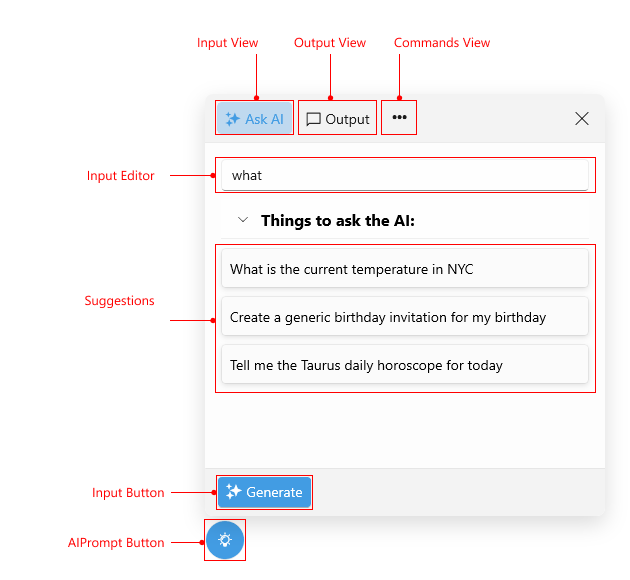

# .NET MAUI AIPrompt Visual Structure

The visual structure of the .NET MAUI AIPrompt represents the anatomy of the UI component. Being familiar with the visual elements of the AIPrompt control allows you to quickly find the information required to configure them.

The following images shows the anatomy of the AIPrompt control.

## Displayed Elements

* **Input View**&mdash;This navigates to the Input View of the AIPrompt. This view displays an input editor and an input button which triggers a response request.
* **Output View**&mdash;This navigates to the Output View of the AIPrompt. This view displays the generated response, which can be interacted with.
* **Commands View**&mdash;Displays a list of predefined actions you can send to the AI model.
* **Suggestions**&mdash;Represents a list of suggestions for the user prior to initiating a request.
* **Input Button**&mdash;This button prompts the RadAIPrompt to request a response.
* **Copy Button**&mdash;This button copies the response.
* **Retry Button**&mdash;This button requests another response from your AI model using the same input text.
* **Rating Buttons**&mdash;These buttons rate the response returned from your AI model.
* **AIPrompt Buttom**&mdash;This button shows a popup with an AIPrompt when interacted with.

## See Also

- [Telerik .NET MAUI Blogs](https://www.telerik.com/blogs/mobile-net-maui)
- [Telerik .NET MAUI Roadmap](https://www.telerik.com/support/whats-new/maui-ui/roadmap)
