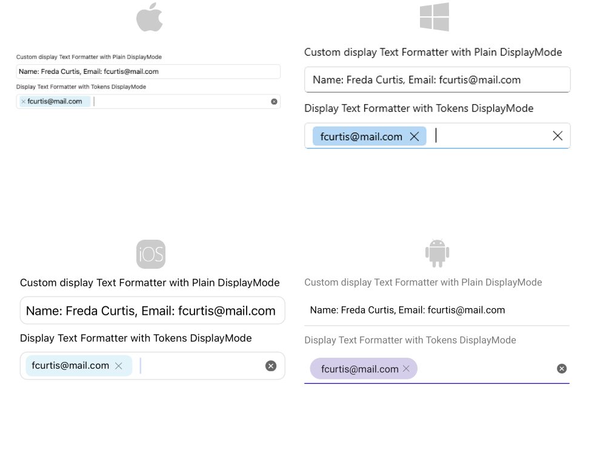

# .NET MAUI Autocomplete Display Text Formatting

The AutoCompleteV control provides the option to format the visualized text in the input, so you could modify the displayed details when item is get from the suggestion view. The format of the text could be defined when `AutoComplete` `DisplayMode` is `Plain` or `Tokens`:

* `DisplayTextFormatter`(IDisplayTextFormatter): Defines the formatter of the selected item.

There are two options to define the formatter of the selected item:

* Set DisplayTextFortammer property and define the name of the property from the business object which will be displaied after formatting.
* Create a custom class that inherits from IDisplayTextFormatter and implement a custom logic how the selected item could be formatted.

## Example

### DisplayText Formatter with DisplayMode Plain

Here is an example how the RadAutoComplete DisplayText Formatter works on Plain DisplayMode:

**1.** Create the needed business objects, for example type Client with the following properties:

<snippet id='autocomplete-client-businessobject'/>

**2.** Create a ViewModel with a collection of Client objects:

<snippet id='autocomplete-clients-viewmodel'/>

**3.** reate a class for example MyTextFormatter that inherist from Telerik.Maui.Controls.AutoComplete.IDisplayTextFormatter:

<snippet id='autocomplete-text-formatter-plain-class'/>

**4.**Use the following snippet to declare a RadAutoComplete in XAML:

<snippet id='autocomplete-textformatter-plain'/>

### DisplayText Formatter with DisplayMode Token

Here is an example how the RadAutoComplete DisplayText Formatter works on Tokens:

First, create the needed business objects, for example type Client with the following properties:

**1.** Create the needed business objects, for example type Client with the following properties:

<snippet id='autocomplete-client-businessobject'/>

**2.** Create a ViewModel with a collection of Client objects:

<snippet id='autocomplete-clients-viewmodel'/>

**3.** Use the following snippet to declare a RadAutoComplete in XAML:

<snippet id='autocomplete-textformatter-tokens'/>

Here is how the DisplayText Formatter looks in both cases:

>important For Autocomplete DisplayText Formatter example refer to the [SDKBrowser Demo application]().

## See Also

