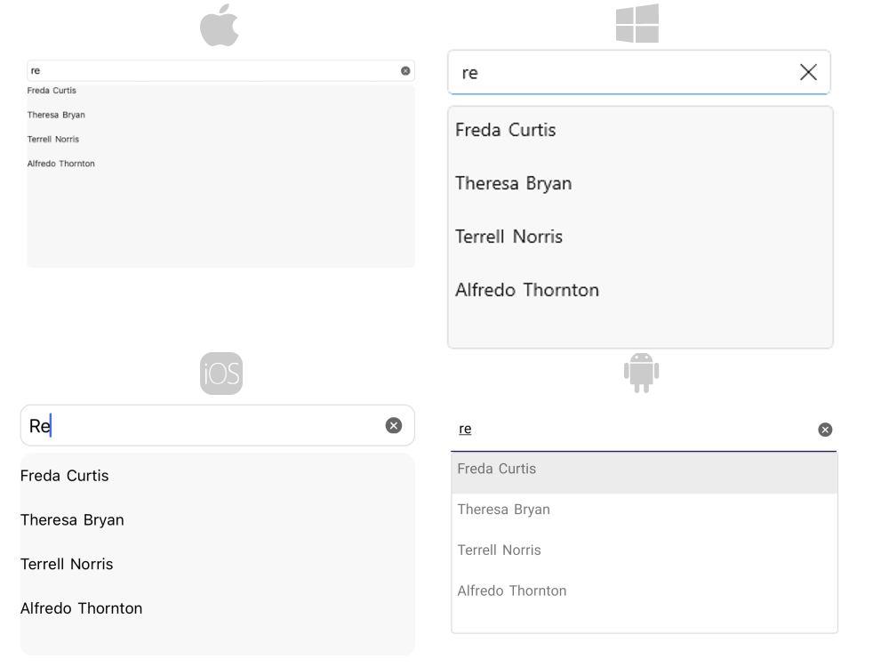

# .NET MAUI AutoComplete Filtering

The Telerik .NET MAUI AutoComplete control allows users to define custom filtering logic through the following property:

* `Filter` (`Telerik.Maui.Controls.AutoComplete.IAutoCompleteFilter`)&mdash;Defines the function that will be used to filter items. 

The `IAutoCompleteFilter` interface contains a `Filter` (`bool`) function that is called by the `RadAutoComplete` control to filter items. The Filter function provides the following properties:

* `item`&mdash;The item to be checked.
* `searchText`&mdash;The current text in the RadAutoComplete control.
* `completionMode`&mdash;The current `CompletionMode` of RadAutoComplete.

* `CompletionMode` of RadAutoComplete.

The function returns true when the item is added into RadAutoComplete `FilteredItems` collection, otherwise it returns false and the item won't be added into RadAutoComplete `FilteredItems` collection.

>The RadAutoComplete `TextSearchPath` property is required in custom filtering scenarios.

## FilteredItems collection

* `FilteredItems` bindable property allows you to access the collection containing the search results of the AutoComplete. The property can be used in scenarios where the search results are visualized at a different place or inside another container.

## Example

Here is an example how the AutoComplete Custom Filtering works when searching in two properties:

**1.** Create the needed business objects, for example type Person with the following properties:

<snippet id='autocomplete-person-businessobject'/>

**2.** Create a `CustomFilterViewModel` with a collection of Person objects:

<snippet id='autocomplete-filering-viewmodel'/>

**3.** Create a class for example `CustomAutoCompleteFilter` that implements the `IAutoCompleteFilter` interface:

<snippet id='autocomplete-filtering-class'/>

**4.** Use the following snippet to declare a RadAutoComplete in XAML:

<snippet id='autocomplete-customfiltering'/>

This is the result:



>important For AutoComplete Filtering example refer to the [SDKBrowser Demo application]().

## Handling Punctuation

By default, the .NET `string.Contains` method will take all punctuation into consideration. If you find punctuation to be hindering your user experience, you can use a custom filter that removes the punctuation before the strings are compared. 

For example, if the source string is `Main Street, 101` and the user searches `Main Street 101`, string.Contains will return false and the result will not appear in the FilteredItems view. The custom filter below removes the commas before the string is used with the Contains method.

```
public class CustomAutoCompleteFilter : IAutoCompleteFilter
{
    public bool Filter(object item, string searchText, AutoCompleteCompletionMode completionMode)
    {
        var googleSearchResult = (string)item;

        // Remove commas from the source value before comparing with the search term
        var googleSearchResultNoCommas = googleSearchResult.Replace(",", "");

        var normalizedPlace = googleSearchResultNoCommas.ToLowerInvariant();
        var normalizedSearchText = searchText.ToLowerInvariant();
        
        return normalizedPlace.Contains(normalizedSearchText);
    }
}
```

## See Also

- [Remote Search]()
- [Events]()
- [Methods]()
