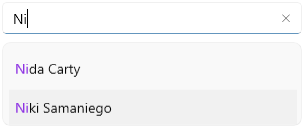

# .NET MAUI AutoComplete Styling

AutoComplete control provides the following Style properties for customizing its look:

* `Font Options`(`FontAttributes`, `FontFamily`, `FontSize`)&mdash;Define the font options to the text of the RadAutoComplete.
* `TextColor`(`Color`)&mdash;Defines the text color of the control.
* `PlaceholderColor`(`Color`)&mdash;Defines the background color of the suggestion view.
* `BorderBrush`(`Brush`)&mdash;Defines the brush of the border around the control.
* `BorderThickness`(`Thickness`)&mdash;Defines the thickness of the border around the control.
* `FocusedBorderBrush`(`Brush`)&mdash;Defines the color of the border when the control is focused.

> For a runnable AutoComplete styling example, refer to the [SDKBrowser Demo application]().

## Clear Button Styling

Use the `ClearButtonStyle` property (of type `Style` with target type `RadButton`) to style the clear button. 

## Suggestion View Styling 

* `SuggestionViewBackgroundColor`(`Color`)&mdash;Defines the background color of the suggestion view.
* `SuggestionViewBorderColor`(`Color`)&mdash;Defines the color of the suggestion view border (drop-down).
* `SuggestionViewBorderThickness`&mdash;Defines the thickness of the border around the suggestion view.
* `SuggestionViewCornerRadius`&mdash;Defines the corner radius applied to the Suggestion View.
* `SuggestionItemHighlightTextColor`&mdash;Defines the highlight color of the selection items.

Here is an example how to use the `SuggestionItemHighlightTextColor` property:

**1.** Create the needed business objects, for example type Client with the following properties:

<snippet id='autocomplete-client-businessobject'/>

**2.** Create a ViewModel with a collection of Client objects:

<snippet id='autocomplete-clients-viewmodel'/>

**3.** Declare the RadAutoComplete in XAML with `SuggestionItemHighlightTextColor` property:

<snippet id='autocomplete-highlight-text'/>

## Highlight Customization

In case a custom template is used, the user can achieve text highlighting inside the `RadAutoComplete.SuggestionItemTemplate` using `RadHighlightLabel`.

The AutoComplete `RadHighlightLabel` exposes the following properties:

* `HighlightTextColor`
* `HighlightText`
* `UnformattedText`

Here is an example with `RadHighlightLabel`:

**1.** Create the needed business objects, for example type Client with the following properties:

<snippet id='autocomplete-client-businessobject'/>

**2.** Create a ViewModel with a collection of Client objects:

<snippet id='autocomplete-clients-viewmodel'/>

**3.** Use the following snippet to declare a RadAutoComplete in XAML with `RadHighlightLabel`:

<snippet id='autocomplete-highlight-text-behavior'/>

Here is the result:

>important For AutoComplete HighlightText example refer to the [SDKBrowser Demo application]().

## See Also

- [Data Binding]()
- [Configuration]()
- [Suggest Mode]()
- [Display Text]()
- [Tokens Support]()
- [Remote Search]()
- [Filtering]()
- [Events]()
- [Methods]()
- [Templates]()