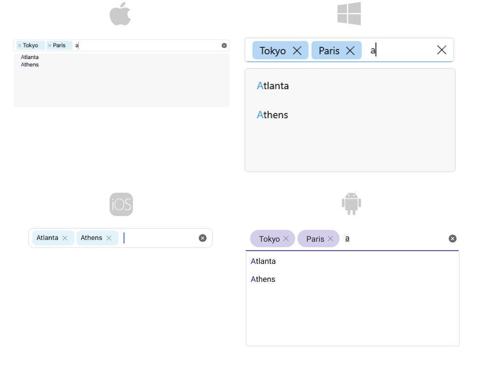

# Tokens Support in .NET MAUI AutoComplete

With AutoComplete, you can enable users to search for and pick some items. These items appear as tokens that can be deselected using their close button.

The Tokens Support feature exposes the following properties:

* `DisplayMode`(`Telerik.Maui.Controls.AutoCompleteDisplayMode`)&mdash;Determines whether a single or multiple items are picked from the suggestion view. The default DisplayMode is `Plain`, for multiple selection you need to set it to `Tokens`.
* `ShowMoreItems`(`bool`)&mdash;Defines the visibility of the view that is used to represents more items. When `ShowMoreItems` is set to `true` and `ShowMoreTemplate` is set, the RadAutoComplete hides the tokens that are not on the first line and will show the hidden count. By default `ShowMoreItems` is `true`. If you want to hide the hidden count you can set the `ShowMoreItems` to `false`.
* `ShowMoreTemplate`(`DataTemplate`)&mdash;Defines the template used to create show more view.

## Tokens Collection

The AutoComplete control provides a readonly collection for the tokens - `Tokens` collection of type `*ObservableCollection&lt;object&gt;*`. When items are selected from the SuggestionView and DisplayMode is Tokens, these items are added to the Tokens collection. To track changes in the Tokens collection when items are added or removed you have to subscribe for the `Tokens.CollectionChanged`. 
For example:

```C#
this.autoComplete.Tokens.CollectionChanged;
```

```C#
private void Tokens_CollectionChanged(object sender, System.Collections.Specialized.NotifyCollectionChangedEventArgs e)
{
   
}
  
```

## Example

Here is an example how the RadAutoComplete Tokens feature works:

**1.** Create the needed business objects, for example type City with the following properties:

<snippet id='autocomplete-city-businessobject'/>

**2.** Create a ViewModel with a collection of City objects:

<snippet id='autocomplete-city-viewmodel'/>

**3.** Use the following snippet to declare a RadAutoComplete in XAML:

<snippet id='autocomplete-tokens'/>

Here is the result when `ShowMoreTemplate` is used:



>important For Autocomplete Tokens example refer to the [SDKBrowser Demo application]().

## See Also

- [Remote Search]()
- [Filtering]()
- [Events]()
- [Methods]()
- [Templates]()
- [Styling]()