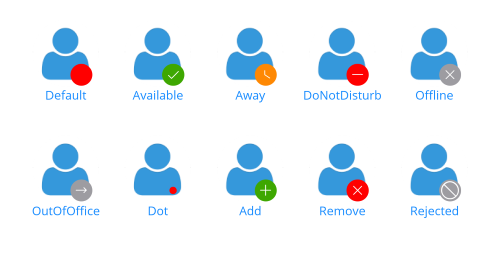

# Badge Types


You can change the Badge type using one of the predefined badge types. 

* `BadgeType`(of type *Telerik.XamarinForms.Primitives.BadgeType*): Specifies the type of the Badge. The default value is `Default`

The available options are:  

* Default 
* Available 
* Away 
* DoNotDisturb 
* Offline 
* OutOfOffice
* Dot  
* Add 
* Remove 
* Rejected 

## Example

Define the BadgeView:

<snippet id='badgeview-badge-types'/>

Use the following namespace:

```XAML
xmlns:telerikPrimitives="clr-namespace:Telerik.XamarinForms.Primitives;assembly=Telerik.Maui.Controls.Compatibility" 
xmlns:telerikListView="clr-namespace:Telerik.XamarinForms.DataControls.ListView;assembly=Telerik.Maui.Controls.Compatibility" 
xmlns:telerikDataControls="clr-namespace:Telerik.XamarinForms.DataControls;assembly=Telerik.Maui.Controls.Compatibility"                        
```

The result:



Badge Types example can be found in [SDKBrowser Demo Application](), just navigate to BadgeView -> Features category.


## See Also

- [Configuration]()
- [Badge Position, Alignment and Offset]()
- [Badge Animation]()
- [Styling]()
- [Customizaation]()
