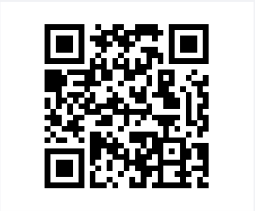

# Getting Started with the .NET MAUI Barcode

This guide provides the information you need to start using the Telerik UI for .NET MAUI Barcode by adding the control to your project.

At the end, you will be able to achieve the following result.



## Prerequisites

Before adding the Barcode, you need to:

1. [Set up your .NET MAUI application](#step-1-set-up-your-net-maui-application).

1. [Download Telerik UI for .NET MAUI](#step-2-download-telerik-ui-for-net-maui).

1. [Install Telerik UI for .NET MAUI](#step-3-install-telerik-ui-for-net-maui).

>important The Barcode is rendered through the [SkiaSharp graphics library](https://skia.org/).

## Define the Control

1. When your .NET MAUI application is set up, you are ready to add a Barcode control to your page. The following example uses the QR Code symbology. For more details on the available Barcode symbologies, refer to the articles on the [supported 1D]() and [2D Barcode types]().

 <snippet id='barcode-gettingstarted' />

1. Add the `telerik` namespace:

 ```XAML
xmlns:telerik="http://schemas.telerik.com/2022/xaml/maui"
 ```

1. Register the Telerik controls through the `Telerik.Maui.Controls.Compatibility.UseTelerik` extension method called inside the `CreateMauiApp` method of the `MauiProgram.cs` file of your project:

```C#
 using Telerik.Maui.Controls.Compatibility;

 public static class MauiProgram
 {
	public static MauiApp CreateMauiApp()
	{
		var builder = MauiApp.CreateBuilder();
		builder
			.UseTelerik()
			.UseMauiApp<App>()
			.ConfigureFonts(fonts =>
			{
				fonts.AddFont("OpenSans-Regular.ttf", "OpenSansRegular");
			});

		return builder.Build();
	}
 }           
```


## Additional Resources

- [.NET MAUI Barcode Product Page](https://www.telerik.com/maui-ui/barcode)
- [.NET MAUI Barcode Forum Page](https://www.telerik.com/forums/maui?tagId=1780)
- [Telerik .NET MAUI Blogs](https://www.telerik.com/blogs/mobile-net-maui)
- [Telerik .NET MAUI Roadmap](https://www.telerik.com/support/whats-new/maui-ui/roadmap)

## See Also

- [1D Supported Barcodes]()
- [2D Supported Barcodes]()
