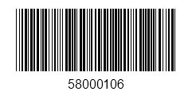

# Value and Symbology

Barcode exposes a `Value` property that is used to set the barcode data presented by the control. The `Value` of the barcode is of type string and the allowed length depends on the symbology you choose.

To set the symbology that will be used to convert the `Value` of the control into a visual barcode representation, use its `Symbology` property.

The most common symbologies that are supported by Barcode are:

* EAN13  
* EAN8  
* UPC-A  
* UPC-E  
* Code39  
* QRCode  
* PDF417   

For more details on the available Telerik UI for .NET MAUI Barcode symbologies, refer to the articles on [supported 1D]() and [2D Barcode types]().

To apply the desired symbology to the Barcode:

Add the symbology you need to the Barcode, for example, the Code39 one.

```XAML
<telerikBarcode:RadBarcode WidthRequest="200" HeightRequest="100"
		HorizontalOptions="Center" VerticalOptions="Center"
		Value="58000106">
	<telerikBarcode:RadBarcode.Symbology>
		<telerikBarcode:Code39 HorizontalTextAlignment="Center"
						  SizingMode="Stretch"
						  ShowText="True"  
						  CodeTextSpacing="10"/>
	</telerikBarcode:RadBarcode.Symbology>
</telerikBarcode:RadBarcode>
```

Add the following namespace.

```XAML
xmlns:telerikBarcode="clr-namespace:Telerik.XamarinForms.Barcode;assembly=Telerik.Maui.Controls.Compatibility"
```

The following image shows a barcode with an applied Code39 symbology.



## See Also

- [1D Supported Barcodes]()
- [2D Supported Barcodes]()
