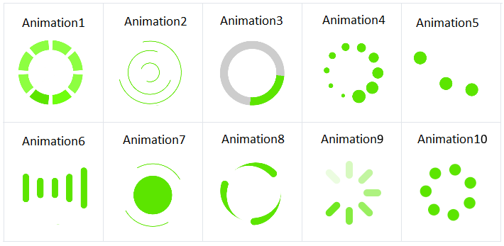

# Animations

## Built-in Animations

RadBusyIndicator provides a set of built-in animations. You can change the selected animation through the `AnimationType` property. The `AnimationType` property is an enum that accepts values from **Animation1** to **Animation10**. **Animation1** is the default.

 

> The animation will be displayed only when the **IsBusy** property is set to **True**.
	
### Changing animation size and color

You can use the following properties to change the size and color of the animated element (animation content):

* `AnimationContentWidthRequest` and `AnimationContentHeightRequest`: Define the animation size;
* `AnimationColor`: Customize the color of the built-in animation.

By default, the size of the animation content is 25x25 pixels.

The snippet below shows how to configure the predefined RadBusyIndicator animations:

<snippet id='busyindicator-animations-settings' />

The image below shows the modified BusyIndicator in busy state:


> `AnimationContentWidthRequest`, `AnimationContentHeightRequest` and `AnimationColor` won't be applied if you use custom animations.
	
## Custom animation

You can create a custom animation by using a combination of 3 properties - `AnimationType`, `BusyContent`, and `Animations`:

* To tell the control that you use a custom animation, set the `AnimationType` to **Custom**.
* Add the content that you want to animate to `BusyContent`.
* The custom animation is added to the `Animations` collection of the busy indicator.

The following example demonstrates how to create a custom animation that changes the opacity of a text (blinking effect).

### Defining custom animation in XAML:

<snippet id='busyindicator-animations-xaml'/>
<snippet id='busyindicator-animations-code'/>

### Defining custom animation in code-behind

```C#
RadBusyIndicator radBusyIndicator = new RadBusyIndicator()
{
    IsBusy = true,
    AnimationType = AnimationType.Custom,
    Content = new Label() { Text = "This is the content of the RadBusyIndicator control displayed when the indicator is not busy." },
    BusyContent = new Label()
    {
        Text = "Loading...",
        VerticalOptions = new LayoutOptions(LayoutAlignment.Center, false),
        HorizontalOptions = new LayoutOptions(LayoutAlignment.Center, false),
    },
};

RadDoubleAnimation annimation = new RadDoubleAnimation() { Duration = 800, From = 0.1, To = 1, PropertyPath = "Opacity", Target = radBusyIndicator.BusyContent, RepeatForever = true, AutoReverse = true };
radBusyIndicator.Animations.Add(annimation);

Device.StartTimer(TimeSpan.FromMilliseconds(5000),
    () =>
    {
        radBusyIndicator.IsBusy = false;
        return false;
    });
```

## See Also

- [Getting Started]()