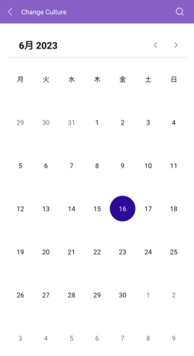

# .NET MAUI Calendar Globalization

Globalization refers to developing an application in such a way that it works on the target device culture. This includes changes in the Calendar day names and first day of week.

The Telerik UI for .NET MAUI Calendar control supports globalization through the `Culture` property (of type `System.Globalization.CultureInfo`).

The following example demonstrates how to set the desired culture in the `RadCalendar`:

**1.** Define the `RadCalendar` in XAML:

<snippet id='calendar-culture'/>

**2.** Add the namespace:

```XAML
xmlns:telerik="http://schemas.telerik.com/2022/xaml/maui"
```

**3.** Set the desired culture in the code-behind:

<snippet id='calendar-setting-culture'/>

This is the result:



> For a runnable example demonstrating how to configure the Calendar Culture, see the [SDKBrowser Demo Application]() and go to the **Calendar > Features** category.

## See Also

- [Navigation]()
- [Display modes]()
- [Formatting]()
- [Selection modes]() 
- [Events]()
- [Commands]()
- [Templates]()
- [Styling]()