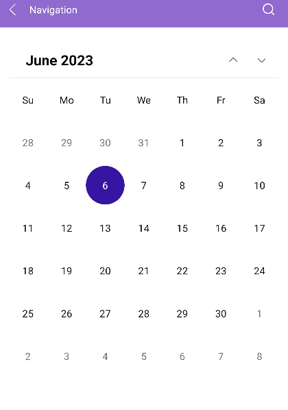
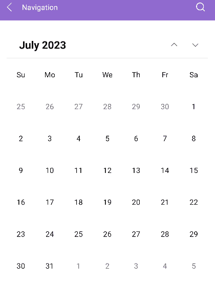

# .NET MAUI Calendar Navigation

You can navigate between the different views of the Calendar programmatically or let the user change the views from the UI.

## Navigating Through Buttons

The Calendar header has two buttons (Previous and Next) that allow the user to navigate in the current view. For example, in the Month view, the Previous button navigates to the previous month, and the Next button navigates to the next month.

## Navigating to the Parent View

The user can interact with the UI and navigate to the parent view by tapping or clicking the header label of the Calendar.

## Restricting the Navigation Depth

To restrict the navigation depth to specific parent or child views, use the following properties:

* `MinDisplayMode`(`Telerik.Maui.controls.Calendar.CalendarDisplayMode`)&mdash;Specifies the minimum display mode of the Calendar.
* `MaxDisplayMode`(`Telerik.Maui.controls.Calendar.CalendarDisplayMode`)&mdash;Specifies the maximum display mode of the Calendar.

## Setting the Scroll Direction

The user can scroll between the [display modes]() of the Calendar horizontally or vertically. To specify the scroll direction, use the `NavigationDirection` property.

* `NavigationDirection`(enum of type `Telerik.Maui.Orientation`)&mdash;Specifies the scroll direction in the view mode of the Calendar. The available options are `Horizontal` (default) and `Vertical`. 

<snippet id='calendar-vertical-navigation'/>

> For a runnable example with the navigation of the Calendar, see the [SDKBrowser Demo Application]() and go to the **Calendar > Features** category.

## Changing the Interaction Mode

Use the `InteractionMode`(enum of type `Telerik.Maui.Controls.Calendar.CalendarInteractionMode`) property of the Calendar to determine whether the user can navigate in the current view through gestures. The available options are `None` and `Pan` (default):

* When the `InteractionMode` is `None`, the users can navigate to next or previous view in the current display mode by using the navigation buttons.
* When the `InteractionMode` is `Pan`, the users can navigate through gestures that target the content area of the Calendar component.

> For a runnable example with the Calendar interaction mode, see the [SDKBrowser Demo Application]() and go to the **Calendar > Features** category.

## See Also

- [Navigation Between the Different Views]()
- [Specify the Formatting]()
- [Selection modes]()
- [Use the exposed Commands]()
- [Define Templates]()
- [Calendar Header Styling]()
