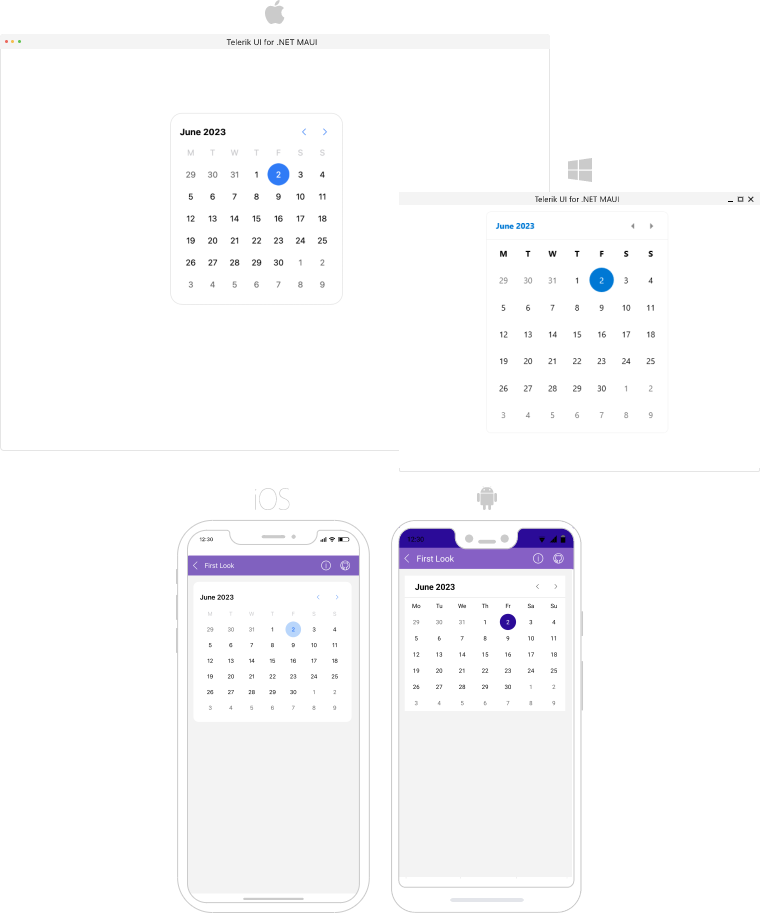

# .NET MAUI Calendar Overview

The Telerik UI for .NET MAUI Calendar allows you to select single or multiple dates by navigating between centuries, decades, years, and months. The control is culture-aware, providing globalization support for all .NET calendar implementations. You can easily customize its appearance by using the flexible styling API and exposed templates. 

## Key Features

* [Different display modes]()&mdash;The Calendar features year, month, decade, and century display modes.
* [Date ranges]()&mdash;Restrict the visible/selectable dates in the Calendar by utilizing the `MinDate` and `MaxDate` properties. 
* [Selection modes]()&mdash;the Calendar provides different types of selection: Single, Multiple, Range, or None. The selected dates can be changed programmatically or when the user taps on a calendar date cell.
* [Flexible date navigation]()&mdash;Easily navigate in the current view by using the buttons in the header of the Calendar.
* [Visibility of the names of the days](#day-names-visibiliy%})&mdash;The Calendar control allows you to hide the names of the  days when using the month view].
* [Header text formatting]()&mdash;You can set the header text format for each display mode. 
* [Templates]()&mdash;The templates allow you to customize how the days, months, years, and decades are presented in the corresponding view.
* [Commands support]()&mdash;The Calendar provides commands that allow the user to navigate in the current view or between the views.
* [Flexible styling API]()&mdash;The styling API allows you to customize the border around the header, the label, navigation buttons, and the content of the corresponding view.
* [Globalization support]()&mdash;The Telerik UI for .NET MAUI Calendar control supports globalization and allows you to adjust its culture through the `Culture` property.

## Next Steps

- [Getting Started with Telerik UI for .NET MAUI Calendar]()

## See Also

- [.NET MAUI Calendar Product Page](https://www.telerik.com/maui-ui/calendar)
- [.NET MAUI Calendar Forum Page](https://www.telerik.com/forums/maui?tagId=1937)
- [Telerik .NET MAUI Blogs](https://www.telerik.com/blogs/mobile-net-maui)
- [Telerik .NET MAUI Roadmap](https://www.telerik.com/support/whats-new/maui-ui/roadmap)
