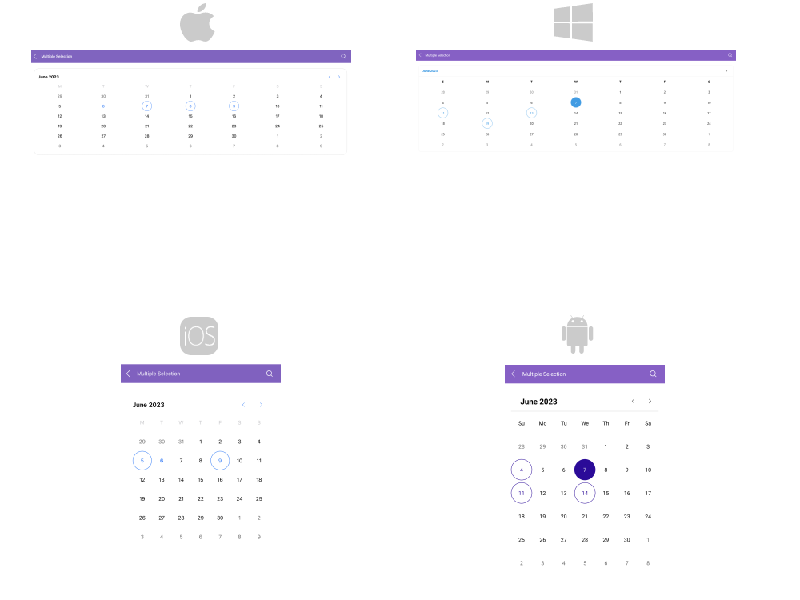

# .NET MAUI Calendar Selection

Calendar for .NET MAUI provides three different types of selection: Single, Multiple and Range. The selected dates can be changed programmatically or when the user taps on a calendar cell.

## Main Properties

* `SelectionMode` (enumeration of type `Telerik.Maui.Controls.Calendar.CalendarSelectionMode`)&mdash;Sppecifies what is the selection applied to the calendar control. You can choose one of the following options:
	* `None`&mdash;Selection is disabled, so you cannot select any dates in the calendar.
	* (Default `SelectionMode`)`Single`&mdash;Select a single date. When tapping/clicking on a date cell, it becomes selected. If another date cell has already been selected it is unselected;
	* `Multiple`&mdash;Select multiple dates. Tapped/clicked on each date cell, changes its selected state. When a date cell is tapped for first time it is added to the current selection and when it is tapped again it is removed from the selection.
	* `Range`&mdash;Allows the users to pick a range of consecutive dates. The first date cell that is tapped gets selected and is considered start of the range. When another cell is tapped, it is considered end of the range and all dates between the start and the end of the range become selected.

* `SelectedDate`(`DateTime?`)&mdash;Specifies the currently selected date. When `Multiple` or `Range` selection is enabled, this value is set to the first selected date.
* `SelectedDates`(`readonly ObservableCollection &lt;DateTime &gt;`)&mdash;Gets the collection with the currently selected dates. When the `SelectionMode` is `Single`, only one date is added in the collection.

**Example for SelectedDates**

Calendar definition:

<snippet id='calendar-selection-properties'/>

The ViewModel:

<snippet id='calendar-selection-viewmodel'/>

The image below shows the result:

**Example with Single selection**

The default `SelectinMode` of the .NET MAUI Calendar control.

<snippet id='calendar-single-selection'/>

This is how single selection looks:

**Example with Multiple selection**

<snippet id='calendar-multiple-selection'/>

This is how multiple selection looks: 

**Example with Range selection**

Here is the Calendar definition in XAML:

<snippet id='calendar-range-selection'/>

This is how range selection looks: 

**Example with disabled selection**

Here is the Calendar definition in XAML:

<snippet id='calendar-disabled-selection'/>

>importantin For the Calendar Selection example refer to the [SDKBrowser Demo Application]() Calendar -> Selection category.

## Events

Calendar exposes a `SelectionChanged` event which is invoked when selection is performed. The `SelectionChanged` event handler receives two parameters
	* The `sender` which is the `RadCalendar` control.
	* `CalendarSelectionChangedEventArgs` provides the following properties:
	- `RemovedDates`&mdash;The dates that were deselected.
	- `AddedDates`&mdash;The dates that were selected.

**Example for `SelectionChanged`**

Calendar definition:

<snippet id='calendar-selection-event'/>

And the event handler:

<snippet id='calendar-selection-changed-event'/>

## See Also

- [Navigation]()
- [Display modes]()
- [Formatting]()
- [Events]()
- [Commands]()
- [Templates]()
- [Styling]()