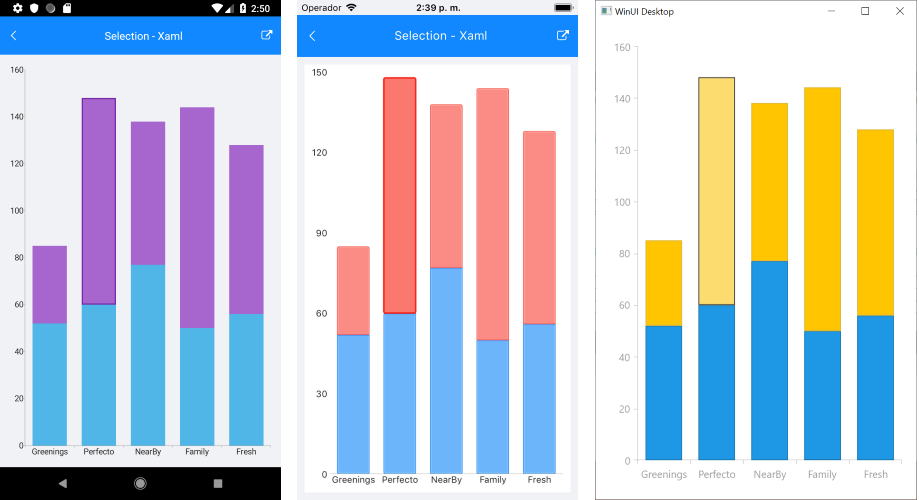

# .NET MAUI Chart Selection Behavior

The Selection behavior of the Chart handles selecting, deselecting, and reporting the selection of either data points or series. In other words, the selection behavior can target data points, series or both if required.

## Features

The Chart exposes properties, methods, events, and commands for handling its Selection behavior.

### Properties

The Selection behavior supports the following properties:

- `DataPointSelectionMode`&mdash;Gets or sets the `ChartSelectionMode` that controls the selection behavior of the data points within the chart series. The available values are:
	-  `None`
	-  `Single`
	-  `Multiple`
- `SeriesSelectionMode`&mdash;Gets or sets the `ChartSelectionMode` that controls the selection behavior of the series within the plot area. The available values are:
	-  `None`
	-  `Single`
	-  `Multiple`
- `SelectedPoints`&mdash;Retrieves all the points from all currently selected series within the chart plot area.
- `SelectedSeries`&mdash;Retrieves all currently selected series instances within the plot area.

### Methods

The Selection behavior supports the `ClearSelecton()` method, which removes the current selection within the chart.

### Events

The Selection behavior supports the `SelectionChanged` event, which occurs when a selection has been made.

### Commands

The Selection behavior supports the `Commands` selection.

## Example

The following example shows how the Selection behavior of the Chart works with a `Command`:

**1.** Create the business objects:

<snippet id='categorical-data-model' />

**2.** Create a `ViewModel`:

```C#
public class ViewModel : NotifyPropertyChangedBase
{
    private int counter = 0;
    private string displayCount;
    public ObservableCollection<CategoricalData> Data1 { get; set; }
    public ObservableCollection<CategoricalData> Data2 { get; set; }
    public ICommand IsSelectionChangedCommand { get; }

    public ViewModel()
    {
        this.Data1 = GetCategoricalData1();
        this.Data2 = GetCategoricalData2();
        this.IsSelectionChangedCommand = new Command(this.IncreaseCount);
    }
    public int Counter
    {
        get
        {
            return this.counter;
        }
        set
        {
            this.counter = value;
            this.DisplayCount = $"Command executed {counter} times.";
        }
    }
    public string DisplayCount
    {
        get
        {
            return this.displayCount;
        }
        set
        {
            if (this.displayCount != value)
            {
                this.displayCount = value;
                this.OnPropertyChanged();
            }
        }
    }

    private static ObservableCollection<CategoricalData> GetCategoricalData1()
    {
        var data = new ObservableCollection<CategoricalData>
        {
            new CategoricalData { Category = "Greenings", Value = 52 },
            new CategoricalData { Category = "Perfecto", Value = 60 },
            new CategoricalData { Category = "NearBy", Value = 77 },
            new CategoricalData { Category = "Family", Value = 50 },
            new CategoricalData { Category = "Fresh", Value = 56 },
        };
        return data;
    }

    private static ObservableCollection<CategoricalData> GetCategoricalData2()
    {
        var data = new ObservableCollection<CategoricalData>  
        {
            new CategoricalData { Category = "Greenings", Value = 33 },
            new CategoricalData { Category = "Perfecto", Value = 88 },
            new CategoricalData { Category = "NearBy", Value = 61 },
            new CategoricalData { Category = "Family", Value = 94 },
            new CategoricalData { Category = "Fresh", Value = 72 },
        };
        return data;
    }
    private void IncreaseCount()
    {
        this.Counter++;
    }
}
```

**3.** Declare a `RadCartesianChart` in XAML:

```XAML
<ContentView.BindingContext>
    <local:ViewModel/>
</ContentView.BindingContext>
<Grid>
    <Grid.RowDefinitions>
        <RowDefinition />
        <RowDefinition Height="Auto" />
        <RowDefinition Height="0.3*"/>
    </Grid.RowDefinitions>

    <telerik:RadCartesianChart Grid.Row="0">
        <telerik:RadCartesianChart.HorizontalAxis>
            <telerik:CategoricalAxis LabelFitMode="MultiLine" />
        </telerik:RadCartesianChart.HorizontalAxis>
        <telerik:RadCartesianChart.VerticalAxis>
            <telerik:NumericalAxis />
        </telerik:RadCartesianChart.VerticalAxis>
        <telerik:RadCartesianChart.Series>
            <telerik:BarSeries ValueBinding="Value"
                                CategoryBinding="Category"
                                CombineMode="Stack"
                                StackGroupKey="1"
                                AllowSelect="True"
                                ItemsSource="{Binding Data1}" />
            <telerik:BarSeries ValueBinding="Value"
                                CategoryBinding="Category"
                                CombineMode="Stack"
                                StackGroupKey="1"
                                AllowSelect="True"
                                ItemsSource="{Binding Data2}" />
        </telerik:RadCartesianChart.Series>
        <telerik:RadCartesianChart.ChartBehaviors>
            <telerik:ChartSelectionBehavior DataPointSelectionMode="Single"
                                                 Command="{Binding IsSelectionChangedCommand}"
                                                 SeriesSelectionMode="None" />
        </telerik:RadCartesianChart.ChartBehaviors>
    </telerik:RadCartesianChart>

    <Label Grid.Row="2" Text="{Binding DisplayCount}"/>
</Grid>
```

The following image shows how the selection looks:



# See Also

- [Chart Track Ball Behavior]()
- [Chart Tool Tip Behavior]()
- [Chart Pan And Zoom Behavior]()
