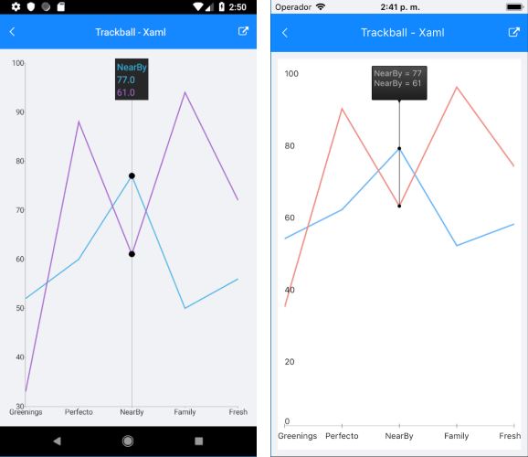

# TrackBall Behavior

The TrackBall behavior is responsible for rendering concise information about several data points in a small popup which displays over its relevant data points. A vertical line is also drawn through the data points for maximum clarity.

## Features

- `ShowTrackInfo` (`bool`)&mdash;Determines whether the visual information for all the closest data points will be displayed.
- `ShowIntersectionPoints` (`bool`)&mdash;Defines a value indicating whether a visual information for all the closest data points will be displayed.

## Example

The following example shows how the TrackBall behavior of the Chart works:

1. Create the needed business objects, for example:

 <snippet id='categorical-data-model' />


1. Create a `ViewModel`:

 ```C#
public class ViewModel
{
    public ObservableCollection<CategoricalData> Data1 { get; set; }
    public ObservableCollection<CategoricalData> Data2 { get; set; }

    public ViewModel()
    {
        this.Data1 = GetCategoricalData1();
        this.Data2 = GetCategoricalData2();
    }

    private static ObservableCollection<CategoricalData> GetCategoricalData1()
    {
        var data = new ObservableCollection<CategoricalData>  {
        new CategoricalData { Category = "Greenings", Value = 52 },
        new CategoricalData { Category = "Perfecto", Value = 60 },
        new CategoricalData { Category = "NearBy", Value = 77 },
        new CategoricalData { Category = "Family", Value = 50 },
        new CategoricalData { Category = "Fresh", Value = 56 },
    };
        return data;
    }

    private static ObservableCollection<CategoricalData> GetCategoricalData2()
    {
        var data = new ObservableCollection<CategoricalData>  {
        new CategoricalData { Category = "Greenings", Value = 33 },
        new CategoricalData { Category = "Perfecto", Value = 88 },
        new CategoricalData { Category = "NearBy", Value = 61 },
        new CategoricalData { Category = "Family", Value = 94 },
        new CategoricalData { Category = "Fresh", Value = 72 },
    };
        return data;
    }
}
 ```

1. Declare a `RadCartesianChart` in XAML:

 ```XAML
<telerik:RadCartesianChart>
    <telerik:RadCartesianChart.BindingContext>
        <local:ViewModel />
    </telerik:RadCartesianChart.BindingContext>
    <telerik:RadCartesianChart.HorizontalAxis>
        <telerik:CategoricalAxis LabelFitMode="MultiLine"
                                      PlotMode="OnTicks" />
    </telerik:RadCartesianChart.HorizontalAxis>
    <telerik:RadCartesianChart.VerticalAxis>
        <telerik:NumericalAxis />
    </telerik:RadCartesianChart.VerticalAxis>
    <telerik:RadCartesianChart.Series>
        <telerik:LineSeries ValueBinding="Value"
                                 CategoryBinding="Category"
                                 DisplayName="Sales 1"
                                 ItemsSource="{Binding Data1}" />
        <telerik:LineSeries ValueBinding="Value"
                                 CategoryBinding="Category"
                                 DisplayName="Sales 2"
                                 ItemsSource="{Binding Data2}" />
    </telerik:RadCartesianChart.Series>
    <telerik:RadCartesianChart.ChartBehaviors>
        <telerik:ChartTrackBallBehavior ShowIntersectionPoints="True"
                                             ShowTrackInfo="True" />
    </telerik:RadCartesianChart.ChartBehaviors>
</telerik:RadCartesianChart>
 ```

The following image shows how the TrackBall looks:



# See Also

- [Chart Selection Behavior]()
- [Chart Tool Tip Behavior]()
- [Chart Pan And Zoom Behavior]()
