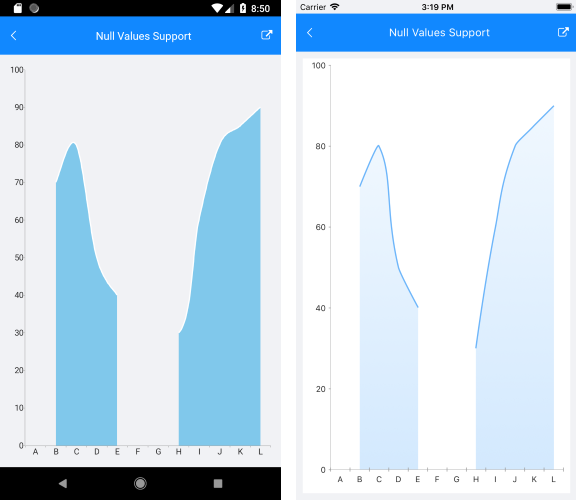

# Null Values

In many scenarios some of the data points that are visualized in the Chart contain empty or null values. These are the cases when data is not available for some records from the used dataset.

In case of Cartesian Series that require X and Y axes (Line, Area, Bar, and so on), the Chart represents `null` data points with an empty space or gap. In case of other chart types (Pie or Donut), these data points are not visualized.

The following example demonstrates a data-bound scenario where a nullable `double` type is used.

1. First, create a `ViewModel` with a collection of `CategoryItems` objects, where a few of the items have null values:

 ```C#
 public class ViewModel
 {
    public ViewModel()
    {
        this.Data = new ObservableCollection<CategoryItem>()
        {
            new CategoryItem { Category = "A" },
            new CategoryItem { Category = "B", Value = 70 },
            new CategoryItem { Category = "C", Value = 80 },
            new CategoryItem { Category = "D", Value = 50 },
            new CategoryItem { Category = "E", Value = 40 },
            new CategoryItem { Category = "F" },
            new CategoryItem { Category = "G" },
            new CategoryItem { Category = "H", Value = 30 },
            new CategoryItem { Category = "I", Value = 60 },
            new CategoryItem { Category = "J", Value = 80 },
            new CategoryItem { Category = "K", Value = 85 },
            new CategoryItem { Category = "L", Value = 90 }
        };
    }

    public ObservableCollection<CategoryItem> Data { get; private set; }
 }

 public class CategoryItem
 {
    public string Category { get; set; }
    public double? Value { get; set; }
 }
 ```

1. Then, add a `RadCartesianChart` with a Spline Area Series, for example:

 ```XAML
<telerikChart:RadCartesianChart>
    <telerikChart:RadCartesianChart.BindingContext>
        <local:ViewModel />
    </telerikChart:RadCartesianChart.BindingContext>
    <telerikChart:RadCartesianChart.HorizontalAxis>
        <telerikChart:CategoricalAxis />
    </telerikChart:RadCartesianChart.HorizontalAxis>
    <telerikChart:RadCartesianChart.VerticalAxis>
        <telerikChart:NumericalAxis Minimum="0" Maximum="100" />
    </telerikChart:RadCartesianChart.VerticalAxis>
    <telerikChart:RadCartesianChart.Series>
        <telerikChart:SplineAreaSeries ValueBinding="Value"
                                       CategoryBinding="Category"
                                       ItemsSource="{Binding Data}" />
    </telerikChart:RadCartesianChart.Series>
</telerikChart:RadCartesianChart>
 ```

The image below shows how the null data points are visualized as gaps.



## See Also

- [Series Overview]()
