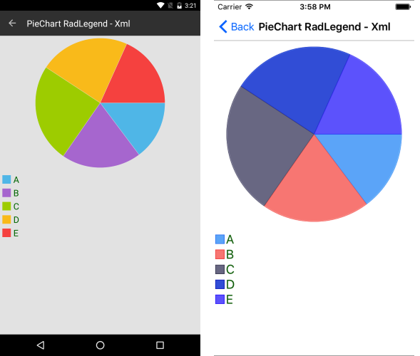
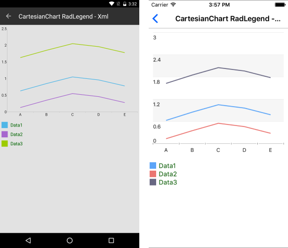

# Chart Legend

The Legend feature of the `RadChart` makes it easy for you to provide description regarding the series which are visualized within the control.

To add the legend feature in your application, you need to initialize a new object of type `RadLegend`.

```XAML
<telerikChart:RadPieChart x:Name="pieChart" HeightRequest="300">
    <telerikChart:RadCartesianChart.BindingContext>
        <local:ViewModel />
    </telerikChart:RadCartesianChart.BindingContext>
    <telerikChart:RadPieChart.Series>
        <telerikChart:PieSeries DisplayName="Value" LegendTitleBinding="Category" ItemsSource="{Binding Data1}" ValueBinding="Value"/>
    </telerikChart:RadPieChart.Series>
</telerikChart:RadPieChart>
<telerikChart:RadLegend HeightRequest="200"
                        LegendItemFontColor="DarkGreen"
                        LegendItemFontSize="20"
                        LegendProvider="{x:Reference Name=pieChart}"/>
```


The following image shows the `RadLegend` in combination with the Pie Chart.



## Properties

As shown in the previous image, each item within the `RadLegend` represents a specific series. The most important property which you need to set is the `LegendProvider`. It will point to the chart object whose series will be included in the legend.

The following list summarizes the most important properties of the `RadLegend` control. In brackets is commented the type of the property:

* `LegendProvider` (`RadChartBase`)&mdash;The Chart control whose series will be described in the legend.
* `LegendItemFontSize` (`double`)&mdash;The size of the item's title text.
* `LegendItemFontColor` (`Color`)&mdash;The color of the item's title text.
* `LegendItemIconSize` (`Size`)&mdash;The size of the title icons.
* `Orientation` (`LegndOrientation`)&mdash;Sets the orientation of the legend. Can be `Horizontal` or `Vertical`.

`RadLegend` can be used in combination with `RadCartesianChart` as well.

The following example demonstrates how to define some of the most important Chart legend properties.

```XAML
<telerikChart:RadCartesianChart x:Name="chart" HeightRequest="300">
  <telerikChart:RadCartesianChart.BindingContext>
    <local:ViewModel />
  </telerikChart:RadCartesianChart.BindingContext>
  <telerikChart:RadCartesianChart.HorizontalAxis>
    <telerikChart:CategoricalAxis />
  </telerikChart:RadCartesianChart.HorizontalAxis>
  <telerikChart:RadCartesianChart.VerticalAxis>
    <telerikChart:NumericalAxis />
  </telerikChart:RadCartesianChart.VerticalAxis>
  <telerikChart:RadCartesianChart.Series>
    <telerikChart:LineSeries CategoryBinding="Category"
                            ValueBinding="Value"
                            DisplayName=" Data1"
                            ItemsSource="{Binding Data1}" />
    <telerikChart:LineSeries CategoryBinding="Category"
                             ValueBinding="Value"
                             DisplayName=" Data2"
                             ItemsSource="{Binding Data2}" />
    <telerikChart:LineSeries CategoryBinding="Category"
                             ValueBinding="Value"
                             DisplayName=" Data3"
                             ItemsSource="{Binding Data3}" />
  </telerikChart:RadCartesianChart.Series>
</telerikChart:RadCartesianChart>
    <telerikChart:RadLegend LegendProvider="{x:Reference Name=chart}"
                            LegendItemFontColor="DarkGreen"
                            HeightRequest="200"/>
```


The following image shows the `RadLegend` control in combination with a Cartesian Chart.



## Legend Title Binding

The `LegendTitleBinding` is a property which can be set specifically for the Pie Series. It points to the property of the data item which will be used as a title in the legend. For all other series, the `DisplayName` property will be used instead.

```XAML
<telerikChart:RadPieChart.Series>
    <telerikChart:PieSeries DisplayName="Value"
							LegendTitleBinding="Category"
							ItemsSource="{Binding Data1}"
							ValueBinding="Value"/>
</telerikChart:RadPieChart.Series>
```

## See Also

- [CartesianChartGrid]()
- [Annotations]()
