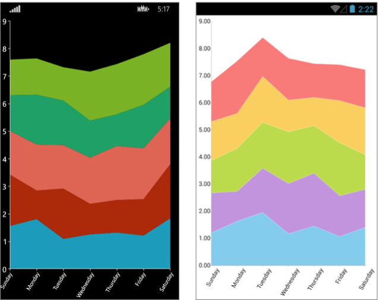

# Overview

**Telerik UI for .NET MAUI Charts** are feature-rich, intuitive, and easy to use data-visualization controls. While the Chart for .NET MAUI capitalizes all the innate benefits of the native UI, it exposes its objects and properties in C#, allowing for no-compromise customization and flexibility. Using Telerik Chart along with the .NET MAUI allows developers to easily implement various chart scenarios in their applications from a single shared C# code base.

The intuitive object model and public API allow complex charts to be easily set up either in XAML or in code-behind. The Chart is completely data-aware as the binding mechanism of the control is used to create the appropriate data points from the raw data. Chart types and series are organized in hierarchies, depending on the coordinate system, used to plot data points.

## Available Chart Types

The Telerik UI for .NET MAUI Chart provides the Cartesian and the Pie Charts as well as a number of series, which enable you to visualize different types of data in various ways and depending on your preferences and requirements.

### Cartesian Charts

The [Cartesian Chart]() uses the Cartesian coordinate system to plot the data points in its chart series. The X and Y axes define how the coordinates of each point in the plot area are calculated.

Depending on the type of Cartesian Chart and the used series, the Chart provides a [Categorical axis](), a [Numerical axis](), and a [Date-Time Continuous axis]().

The Cartesian Chart supports a number of series types, among which:

* Categorical Series such as the [Area]() and [Bar]() Charts.
* Scatter Series such as the [Scatter Line]() and [ScatterPoint]() Charts.
* Financial Series such as the [OHLC]() and [Candlestick]() Charts.

The Cartesian Chart also provides the [Chart Grid type](), which is optionally decorated with grid-like visuals, which support horizontal and vertical lines, and are associated with axis ticks and horizontal and vertical stripes (the area between two adjacent ticks).

### Pie Charts

The [Pie Chart]() visualizes its data points by using a discrete polar coordinate system. Each point is represented as an arc segment. The arc length represents the point’s value percentage of the total sum. Telerik UI for .NET MAUI provides the [Donut Series]() and the [Pie Series]().

## Key Features

Each Telerik UI for .NET MAUI Chart delivers a range of handy and developer-friendly features whose number and further development are not limited by the list in this section. The team constantly invests efforts to improve the performance and add more value to the existing Charts library as well as develop new features and controls to it.

### Behaviors

Each Telerik UI for .NET MAUI Chart can be enabled with interactivity through its `Behaviors` property. A behavior is generally an abstraction that handles user input in a `RadChart` instance and, optionally, provides visual feedback upon some action.

The Telerik UI for .NET MAUI Charts support the following behaviors:

- [Pan-and-Zoom behavior]()&mdash;This behavior handles `Manipulation` events and/or `MouseMove` and `MouseWheel` to enable the panning and zooming of the associated chart plot area.
- [Tooltip behavior]()&mdash;This behavior handles `Hold` and/or `MouseMove` events to enable context-sensitive information about a data point. It differs from the `TrackballBehavior` in terms of visual information and trigger action.
- [Selection behavior]()&mdash;This behavior handles the `Tap` event to enable the selection and deselection of data points and/or chart series. When a data point becomes `"Selected"`, you can use the `SelectionPalette` property of the Chart to visualize the selected point.
- [TrackBall behavior]()&mdash;This behavior handles `Hold` events to enable context-sensitive information about a data point.

### Annotations

You can also show [annotations]() in the Chart. Annotations are visual elements that can be used to highlight certain areas on the plot area and to denote statistical significance.

The provided types of annotations include:

- `CartesianGridLine`&mdash;In the Cartesian Chart, the grid line represents a vertical or horizontal line which crosses the entire plot area.
- `CartesianPlotBand`&mdash;The Cartesian Plot Band annotation is either a horizontal or a vertical stripe that crosses entirely the vertical or horizontal axis respectively.

### Labels

The Chart can display different labels for the series and axes that are displayed. Additionally, you can customize the labels according to your preferences.

## Next Steps

- [Getting Started with Telerik UI for .NET MAUI Charts]()
- [Overview of the Cartesian Charts]()
- [Overview of the Pie Charts]()
- [Overview of the Chart Series]()
- [Common Features for the Chart Series]()
