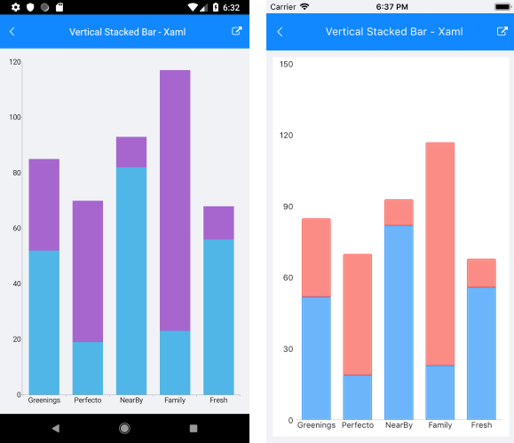

# Combine Mode

When the series in a RadCartesianChart are more than one, a few different drawing strategies can be used. The possible strategies are:

- **None**: The series are not combined - each series is plotted independently.
- **Cluster**: Series are combined next to each other (applicable for BarSeries).
- **Stack**: Series form stacks.
- **Stack100**: Series form stacks that occupy 100% of the plot area and the characterictic size of each series is proportional to its relative value.

The default combine mode is **None**. You can define the current combine mode with the series **CombineMode** property.

>note CombineMode could be applied only to Categorical Series, such as Bar, Line and Area.

## Stack Bar Series Example

Here is an example how to create Stack CartesianChart with Bar Series :

Create the needed business objects, for example:

```C#
public class CategoricalData
{
    public object Category { get; set; }

    public double Value { get; set; }
}
```

Create a ViewModel:

```C#
public class SeriesCategoricalViewModel
{
    public ObservableCollection<CategoricalData> Data1 { get; set; }
    public ObservableCollection<CategoricalData> Data2 { get; set; }

    public SeriesCategoricalViewModel()
    {
        this.Data1 = GetCategoricalData1();
        this.Data2 = GetCategoricalData2();
    }

    private static ObservableCollection<CategoricalData> GetCategoricalData1()
    {
        var data = new ObservableCollection<CategoricalData>
        {
            new CategoricalData { Category = "Greenings", Value = 52 },
            new CategoricalData { Category = "Perfecto", Value = 19 },
            new CategoricalData { Category = "NearBy", Value = 82 },
            new CategoricalData { Category = "Family", Value = 23 },
            new CategoricalData { Category = "Fresh", Value = 56 },
        };
        return data;
    }

    private static ObservableCollection<CategoricalData> GetCategoricalData2()
    {
        var data = new ObservableCollection<CategoricalData>
        {
            new CategoricalData { Category = "Greenings", Value = 33 },
            new CategoricalData { Category = "Perfecto", Value = 51 },
            new CategoricalData { Category = "NearBy", Value = 11 },
            new CategoricalData { Category = "Family", Value = 94 },
            new CategoricalData { Category = "Fresh", Value = 12 },
        };
        return data;
    }
}
```

Declare a CombineMode property to the Bar Series in XAML:

```XAML
<telerikChart:RadCartesianChart>
    <telerikChart:RadCartesianChart.BindingContext>
        <local:SeriesCategoricalViewModel />
    </telerikChart:RadCartesianChart.BindingContext>
    <telerikChart:RadCartesianChart.HorizontalAxis>
        <telerikChart:CategoricalAxis LabelFitMode="MultiLine" />
    </telerikChart:RadCartesianChart.HorizontalAxis>
    <telerikChart:RadCartesianChart.VerticalAxis>
        <telerikChart:NumericalAxis LabelFitMode="MultiLine" />
    </telerikChart:RadCartesianChart.VerticalAxis>
    <telerikChart:RadCartesianChart.Series>
        <telerikChart:BarSeries ValueBinding="Value"
                                CategoryBinding="Category"
                                CombineMode="Stack"
                                ItemsSource="{Binding Data1}" />
        <telerikChart:BarSeries ValueBinding="Value"
                                CategoryBinding="Category"
                                CombineMode="Stack"
                                ItemsSource="{Binding Data2}" />
    </telerikChart:RadCartesianChart.Series>
</telerikChart:RadCartesianChart>
```

Here is how Stack Bar Series looks:



## Stack Area Series Example

Here is how Stack Area Series looks:


## Stack Spline Area Series Example

Here is how Stack Spline Area Series looks:


## See Also

- [CartesianChart Orientation]()
