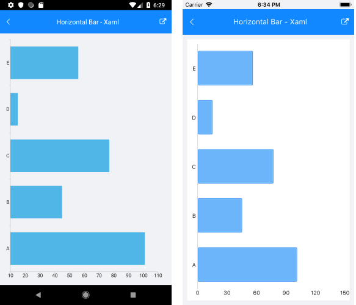
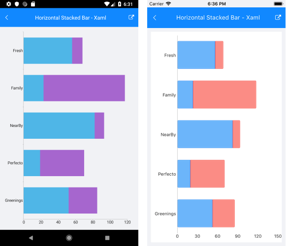

# Categorical Series Orientation

The orientation of the series depends on which chart axis is horizontal and which one is vertical.

>note The `Orientation` property can be applied only to Categorical Series, such as Bar, Line, and Area.

## Horizontal Bar Series Example

The following example shows how to create a Cartesian Chart with a vertical `CategoricalAxis` and a Horizontal Bar Series:

1. First, create the needed business objects, for example:

 ```C#
public class CategoricalData
{
    public object Category { get; set; }

    public double Value { get; set; }
}
 ```

1. Then, create a `ViewModel`:

 ```C#
public class CategoricalDataViewModel
{
    public ObservableCollection<CategoricalData> Data { get; set; }

    public CategoricalDataViewModel()
    {
        this.Data = GetCategoricalData();
    }

    private static ObservableCollection<CategoricalData> GetCategoricalData()
    {
        var data = new ObservableCollection<CategoricalData>
        {
            new CategoricalData { Category = "A", Value = 101 },
            new CategoricalData { Category = "B", Value = 45 },
            new CategoricalData { Category = "C", Value = 77 },
            new CategoricalData { Category = "D", Value = 15 },
            new CategoricalData { Category = "E", Value = 56 },
        };
        return data;
    }
}
 ```

1. Finally, use the following snippet to declare a `RadCartesianChart` with a Bar Series in XAML:

 ```XAML
<telerikChart:RadCartesianChart>
    <telerikChart:RadCartesianChart.BindingContext>
        <local:CategoricalDataViewModel />
    </telerikChart:RadCartesianChart.BindingContext>
    <telerikChart:RadCartesianChart.VerticalAxis>
        <telerikChart:CategoricalAxis />
    </telerikChart:RadCartesianChart.VerticalAxis>
    <telerikChart:RadCartesianChart.HorizontalAxis>
        <telerikChart:NumericalAxis />
    </telerikChart:RadCartesianChart.HorizontalAxis>
    <telerikChart:RadCartesianChart.Series>
        <telerikChart:BarSeries ValueBinding="Value"
                                CategoryBinding="Category"
                                ItemsSource="{Binding Data}" />
    </telerikChart:RadCartesianChart.Series>
</telerikChart:RadCartesianChart>
 ```


The following image shows the end result.



## Horizontal Stack Bar Series Example

The following example shows how to create a Cartesian Chart with a vertical `CategoricalAxis` and a Stack Horizontal Bar Series:

1. First, create the needed business objects, for example:

 ```C#
public class CategoricalData
{
    public object Category { get; set; }

    public double Value { get; set; }
}
 ```

1. Then create a `ViewModel`:

 ```C#
public class SeriesCategoricalViewModel
{
    public ObservableCollection<CategoricalData> Data1 { get; set; }
    public ObservableCollection<CategoricalData> Data2 { get; set; }

    public SeriesCategoricalViewModel()
    {
        this.Data1 = GetCategoricalData1();
        this.Data2 = GetCategoricalData2();
    }

    private static ObservableCollection<CategoricalData> GetCategoricalData1()
    {
        var data = new ObservableCollection<CategoricalData>
        {
            new CategoricalData { Category = "Greenings", Value = 52 },
            new CategoricalData { Category = "Perfecto", Value = 19 },
            new CategoricalData { Category = "NearBy", Value = 82 },
            new CategoricalData { Category = "Family", Value = 23 },
            new CategoricalData { Category = "Fresh", Value = 56 },
        };
        return data;
    }

    private static ObservableCollection<CategoricalData> GetCategoricalData2()
    {
        var data = new ObservableCollection<CategoricalData>
        {
            new CategoricalData { Category = "Greenings", Value = 33 },
            new CategoricalData { Category = "Perfecto", Value = 51 },
            new CategoricalData { Category = "NearBy", Value = 11 },
            new CategoricalData { Category = "Family", Value = 94 },
            new CategoricalData { Category = "Fresh", Value = 12 },
        };
        return data;
    }
}
 ```

1. Finally, use the following snippet to declare a Cartesian Chart with a Bar Series in XAML:

 ```XAML
<telerikChart:RadCartesianChart>
    <telerikChart:RadCartesianChart.BindingContext>
        <local:SeriesCategoricalViewModel />
    </telerikChart:RadCartesianChart.BindingContext>
    <telerikChart:RadCartesianChart.VerticalAxis>
        <telerikChart:CategoricalAxis />
    </telerikChart:RadCartesianChart.VerticalAxis>
    <telerikChart:RadCartesianChart.HorizontalAxis>
        <telerikChart:NumericalAxis />
    </telerikChart:RadCartesianChart.HorizontalAxis>
    <telerikChart:RadCartesianChart.Series>
        <telerikChart:BarSeries ValueBinding="Value"
                                CategoryBinding="Category"
                                CombineMode="Stack"
                                ItemsSource="{Binding Data1}" />
        <telerikChart:BarSeries ValueBinding="Value"
                                CategoryBinding="Category"
                                CombineMode="Stack"
                                ItemsSource="{Binding Data2}" />
    </telerikChart:RadCartesianChart.Series>
</telerikChart:RadCartesianChart>
 ```


The following image shows the end result:



## See Also

- [CartesianChart Combine Mode]()
