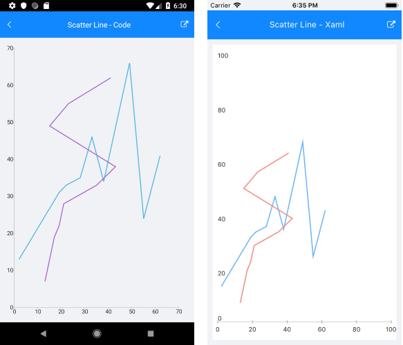

# ScatterLine Series

The ScatterLine Series are represented on the chart as data points connected with straight line segments. The ScatterLine Series inherit from the `[ScatterPointSeries]()` class and also require both axes of the chart to be Numerical Axes.

## Features

The ScatterLine Series provides the following properties to change its style:

- `Stroke` (Color)&mdash;Changes the color for drawing lines.
- `StrokeThickness` (double)&mdash;Changes the width of the lines.

## ScatterLine Series Example

The following example shows how to create a `RadCartesianChart` with a ScatterLine Series:

1. First, create the needed business objects, for example:

 ```C#
public class NumericalData
{
    public double XData { get; set; }
    public double YData { get; set; }
}
 ```

1. Then, create a `ViewModel`:

 ```C#
public class SeriesNumericalViewModel
{
    public ObservableCollection<NumericalData> Data1 { get; set; }
    public ObservableCollection<NumericalData> Data2 { get; set; }

    public SeriesNumericalViewModel()
    {
        this.Data1 = GetNumericData1();
        this.Data2 = GetNumericData2();
    }

    public static ObservableCollection<NumericalData> GetNumericData1()
    {
        var data = new ObservableCollection<NumericalData>
        {
            new NumericalData { XData = 2, YData = 13 },
            new NumericalData { XData = 19, YData = 31 },
            new NumericalData { XData = 22, YData = 33 },
            new NumericalData { XData = 28, YData = 35 },
            new NumericalData { XData = 33, YData = 46 },
            new NumericalData { XData = 38, YData = 34 },
            new NumericalData { XData = 49, YData = 66 },
            new NumericalData { XData = 55, YData = 24 },
            new NumericalData { XData = 62, YData = 41 },
        };
        return data;
    }
    public static ObservableCollection<NumericalData> GetNumericData2()
    {
        var data = new ObservableCollection<NumericalData>
        {
            new NumericalData { XData = 7, YData = 13 },
            new NumericalData { XData = 19, YData = 17 },
            new NumericalData { XData = 22, YData = 19 },
            new NumericalData { XData = 28, YData = 21 },
            new NumericalData { XData = 33, YData = 35 },
            new NumericalData { XData = 38, YData = 43 },
            new NumericalData { XData = 49, YData = 15 },
            new NumericalData { XData = 55, YData = 21 },
            new NumericalData { XData = 62, YData = 47 },
        };
        return data;
    }
}
 ```

1. Finally, use the following snippet to declare a `RadCartesianChart` with a ScatterLine Series in XAML:

 ```XAML
<telerikChart:RadCartesianChart>
    <telerikChart:RadCartesianChart.BindingContext>
        <local:SeriesNumericalViewModel />
    </telerikChart:RadCartesianChart.BindingContext>
    <telerikChart:RadCartesianChart.HorizontalAxis>
        <telerikChart:NumericalAxis LabelFitMode="MultiLine" />
    </telerikChart:RadCartesianChart.HorizontalAxis>
    <telerikChart:RadCartesianChart.VerticalAxis>
        <telerikChart:NumericalAxis />
    </telerikChart:RadCartesianChart.VerticalAxis>
    <telerikChart:RadCartesianChart.Series>
        <telerikChart:ScatterLineSeries XValueBinding="XData"
                                        YValueBinding="YData"
                                        ItemsSource="{Binding Data1}" />
        <telerikChart:ScatterLineSeries XValueBinding="XData"
                                        YValueBinding="YData"
                                        ItemsSource="{Binding Data2}" />
    </telerikChart:RadCartesianChart.Series>
</telerikChart:RadCartesianChart>
 ```


The following image shows the end result:



## Customization Example

The following example adds customizations to the ScatterLine Series by applying `Stroke` and `StrokeThickness` to the series.

```XAML
<telerikChart:RadCartesianChart>
    <telerikChart:RadCartesianChart.BindingContext>
        <local:SeriesNumericalViewModel />
    </telerikChart:RadCartesianChart.BindingContext>
    <telerikChart:RadCartesianChart.HorizontalAxis>
        <telerikChart:NumericalAxis LabelFitMode="MultiLine" />
    </telerikChart:RadCartesianChart.HorizontalAxis>
    <telerikChart:RadCartesianChart.VerticalAxis>
        <telerikChart:NumericalAxis />
    </telerikChart:RadCartesianChart.VerticalAxis>
    <telerikChart:RadCartesianChart.Series>
        <telerikChart:ScatterLineSeries XValueBinding="XData"
                                        YValueBinding="YData"
                                        Stroke="Red"
                                        StrokeThickness="5"
                                        ItemsSource="{Binding Data1}" />
        <telerikChart:ScatterLineSeries XValueBinding="XData"
                                        YValueBinding="YData"
                                        Stroke="Blue"
                                        StrokeThickness="5"
                                        ItemsSource="{Binding Data2}" />
    </telerikChart:RadCartesianChart.Series>
</telerikChart:RadCartesianChart>
```


The following image shows the final result:


## See Also

- [Line Series]()
- [ScatterPoint Series]()
- [Spline Series]()
