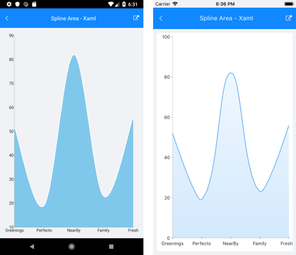
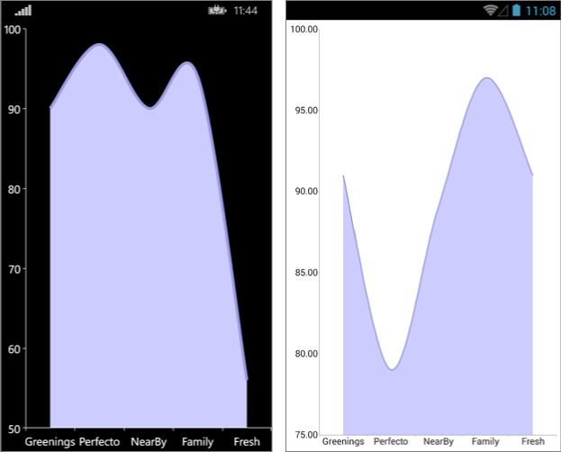

# SplineArea Series

The Cartesian Chart visualizes the SplineArea Series as an area on the chart that is enclosed by the coordinate axes and straight line segments, which connect the data points represented by these series. The SplineArea Series extend the Categorical Stroked Series, so they are also Categorical Series and require one Categorical Axis and one Numerical Axis.

## Features

The SplineArea Series provides the following properties:

- `Stroke` (Color)&mdash;Changes the color for drawing lines.
- `StrokeThickness` (double)&mdash;Changes the width of the lines.
- `Fill` (Color)&mdash;Changes the color for filling the area shapes.

## SplineArea Series Example

The following example shows how to create a `RadCartesianChart` with a SplineArea Series:

1. First, create the needed business objects, for example:

 ```C#
public class CategoricalData
{
    public object Category { get; set; }

    public double Value { get; set; }
}
 ```

1. Then, create a `ViewModel`:

 ```C#
public class CategoricalViewModel
{
    public ObservableCollection<CategoricalData> Data { get; set; }

    public CategoricalViewModel()
    {
        this.Data = GetCategoricalData();
    }

    private static ObservableCollection<CategoricalData> GetCategoricalData()
    {
        var data = new ObservableCollection<CategoricalData>
        {
            new CategoricalData { Category = "Greenings", Value = 52 },
            new CategoricalData { Category = "Perfecto", Value = 19 },
            new CategoricalData { Category = "NearBy", Value = 82 },
            new CategoricalData { Category = "Family", Value = 23 },
            new CategoricalData { Category = "Fresh", Value = 56 },
        };
        return data;
    }
}
 ```

1. Finally, use the following snippet to declare a `RadCartesianChart` with a SplineArea Series in XAML and in C#:

 ```XAML
<telerikChart:RadCartesianChart>
    <telerikChart:RadCartesianChart.BindingContext>
        <local:CategoricalViewModel />
    </telerikChart:RadCartesianChart.BindingContext>
    <telerikChart:RadCartesianChart.HorizontalAxis>
        <telerikChart:CategoricalAxis LabelFitMode="MultiLine"
                                      PlotMode="OnTicks" />
    </telerikChart:RadCartesianChart.HorizontalAxis>
    <telerikChart:RadCartesianChart.VerticalAxis>
        <telerikChart:NumericalAxis />
    </telerikChart:RadCartesianChart.VerticalAxis>
    <telerikChart:RadCartesianChart.Series>
        <telerikChart:SplineAreaSeries ValueBinding="Value"
                                       CategoryBinding="Category"
                                       ItemsSource="{Binding Data}" />
    </telerikChart:RadCartesianChart.Series>
</telerikChart:RadCartesianChart>
 ```


The following image shows the end result:



## Customization Example

You can further customize the SplineArea Series:

```C#
	var series = new SplineAreaSeries
	{
		Stroke = new Color(0.6, 0.6, 0.9),
		StrokeThickness = 5,
		Fill = new Color(0.8, 0.8, 1)
	};
```



## See Also

- [Line Series]()
- [ScatterLine Series]()
- [Spline Series]()
