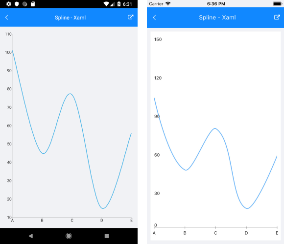
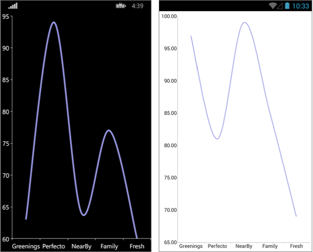

# Spline Series

The Cartesian Chart visualizes each data item from the Line Series and connects them with curved line segments. The Spline Series extend the [Line Series](), so they are also Categorical Series and require one Categorical Axis and one Numerical Axis.

## Features

The Spline Series extend the Line Series so they provide the same properties to change their style:

- `Stroke` (Color)&mdash;Changes the color for drawing lines.
- `StrokeThickness` (double)&mdash;Changes the width of the lines.

## Spline Series Example

The following example shows how to create a `RadCartesianChart` with a Spline Series:

1. First, create the needed business objects, for example:

 ```C#
public class CategoricalData
{
    public object Category { get; set; }

    public double Value { get; set; }
}
 ```

1. Then, create a `ViewModel`:

 ```C#
public class CategoricalDataViewModel
{
    public ObservableCollection<CategoricalData> Data { get; set; }

    public CategoricalDataViewModel()
    {
        this.Data = GetCategoricalData();
    }

    private static ObservableCollection<CategoricalData> GetCategoricalData()
    {
        var data = new ObservableCollection<CategoricalData>
        {
            new CategoricalData { Category = "A", Value = 101 },
            new CategoricalData { Category = "B", Value = 45 },
            new CategoricalData { Category = "C", Value = 77 },
            new CategoricalData { Category = "D", Value = 15 },
            new CategoricalData { Category = "E", Value = 56 },
        };
        return data;
    }
}
 ```

1. Finally, use the following snippet to declare a `RadCartesianChart` with a Spline Series in XAML:

 ```XAML
<telerikChart:RadCartesianChart>
    <telerikChart:RadCartesianChart.BindingContext>
        <local:CategoricalDataViewModel />
    </telerikChart:RadCartesianChart.BindingContext>
    <telerikChart:RadCartesianChart.HorizontalAxis>
        <telerikChart:CategoricalAxis LabelFitMode="MultiLine"
                                      PlotMode="OnTicks" />
    </telerikChart:RadCartesianChart.HorizontalAxis>
    <telerikChart:RadCartesianChart.VerticalAxis>
        <telerikChart:NumericalAxis />
    </telerikChart:RadCartesianChart.VerticalAxis>
    <telerikChart:RadCartesianChart.Series>
        <telerikChart:SplineSeries ValueBinding="Value"
                                   CategoryBinding="Category"
                                   ItemsSource="{Binding Data}" />
    </telerikChart:RadCartesianChart.Series>
</telerikChart:RadCartesianChart>
 ```


The following image shows the end result:



## Customization Example

You can further customize the Spline Series:

```C#
	var series = new SplineSeries
	{
		Stroke = new Color(0.6, 0.6, 0.9),
		StrokeThickness = 5
	};
```



## See Also

- [ScatterArea Series]()
- [ScatterLine Series]()
- [ScatterPoint Series]()
