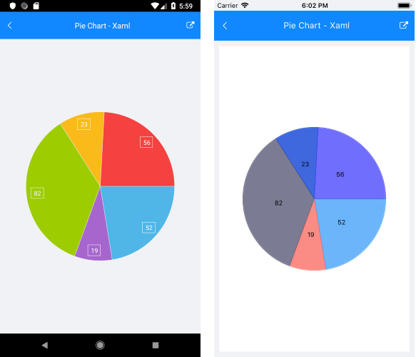

# Pie Series

The Pie Chart visualizes the Pie Series in the shape of a pie. Each data item is visually represented by a pie slice. The ratio between the space consumed by each slice and the space consumed by the whole chart is the same as the ratio between the value of the data point that it represents and the total value of all data points in the series.

## Features

The Pie Series supports the following properties:

- `ValueBinding`&mdash;Defines the binding to a property of the data model that will be used to fill the pie slices.
- `RadiusFactor`&mdash;Defines the radius factor used to calculate the radius of the visual series. This value is usually within the [0,1] range but it is possible to oversize the series by setting a value greater than 1.
- `SelectedPointOffset`&mdash;Defines the offset applied to the currently selected point.

## Example

The following example shows how to create a basic `RadPieChart` with a Pie Series in XAML.

1. Create the needed business object:

 ```C#
public class CategoricalData
{
    public object Category { get; set; }

    public double Value { get; set; }
}
 ```

1. Create a `ViewModel`:

 ```C#
public class ViewModel
{
    public ObservableCollection<CategoricalData> Data { get; set; }

    public ViewModel()
    {
        this.Data = GetCategoricalData();
    }

    private static ObservableCollection<CategoricalData> GetCategoricalData()
    {
        var data = new ObservableCollection<CategoricalData>
        {
            new CategoricalData { Category = "Greenings", Value = 52 },
            new CategoricalData { Category = "Perfecto", Value = 19 },
            new CategoricalData { Category = "NearBy", Value = 82 },
            new CategoricalData { Category = "Family", Value = 23 },
            new CategoricalData { Category = "Fresh", Value = 56 },
        };
        return data;
    }
}
 ```

1. Declare a `RadPieChart` with Pie Series in XAML:

 ```XAML
<telerikChart:RadPieChart>
    <telerikChart:RadPieChart.BindingContext>
        <local:ViewModel />
    </telerikChart:RadPieChart.BindingContext>
    <telerikChart:RadPieChart.Series>
        <telerikChart:PieSeries ShowLabels="True"
                                RadiusFactor="0.8"
                                ValueBinding="Value"
                                ItemsSource="{Binding Data}" />
    </telerikChart:RadPieChart.Series>
</telerikChart:RadPieChart>
 ```

The following image shows the end result:



## See Also

- [Donut Series]()
- [Bar Series]()
- [Categorical Series Overview]()
