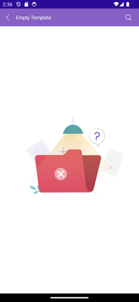

# .NET MAUI CollectionView Empty Template

The CollectionView allows you to specify a template that the control will use when the `ItemsSource` is null or the collection is empty. In this way, you notify the user that no data is available to display.

* `EmptyContentTemplate`(`DataTemplate`)&mdash;Defines the content of the view which is shown when in the view has no items.

* `EmptyContentDisplayMode`&mdash;Defines the modes for displaying empty content. The property has two modes:
       - `ItemsSourceNull`&mdash;Displays the empty content view only when the `ItemsSource` is null.
       - `ItemsSourceNullOrEmpty`&mdash;Displays the empty content view when `ItemsSource` is null or when the source is empty (has zero items).

## Example: Defining the EmptyTemplate in the CollectionView

**1.** Define the `RadCollectionView` in XAML:

<snippet id='collectionview-empty-template'/>

**2.** Add the `telerik` namespace:

```XAML
xmlns:telerik="http://schemas.telerik.com/2022/xaml/maui"
```

This is the result on Android:



> For a runnable example demonstrating the CollectionView `EmptyTemplate`, see the [SDKBrowser Demo Application]() and go to **CollectionView > EmptyTemplate** category.

## See Also

- [Grouping]()
- [Filtering]()
- [Selection]()
- [Commands]()