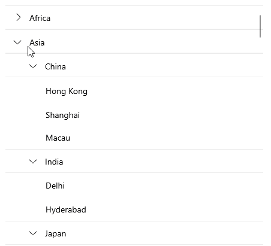
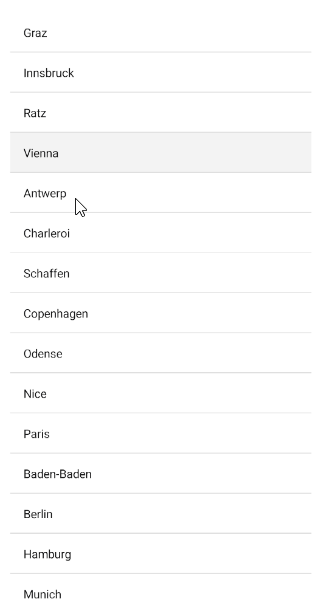

# .NET MAUI CollectionView Events

The Telerik UI for .NET MAUI CollectionView component exposes a set of events that users trigger through interaction. You can handle these events and customize the configuration of the UI component.

## Item Events

* `ItemTapped`&mdash;Raised when the user taps on the item. The `ItemTapped` event handler receives two parameters:
	* The `sender` argument, which is of type `object`, but can be cast to the `CollectionView` type.
	* A `TappedEventArgs` object, which has a reference to the tapped item through its `Data`(`T`) property.

* `GroupTapped`&mdash;Raised when the user taps on the group item. The `GroupTapped` event handler receives two parameters:
	* The `sender` argument, which is of type `object`, but can be cast to the `CollectionView` type.
	* A `TappedEventArgs<Telerik.Maui.Controls.CollectionView.GroupContext>` object, which has a reference to:
		* the tapped group item through its `Data`(`T`) property.
		* the `GroupContext` represents the object that is passed to the `TappedEventArgs ` for the `GroupTapped` and the item you have for the `GroupViewStyleSelector` and `GroupHeaderTemplate`. The `GroupContext` includes the following properties:

				* `IsExpanded` (`bool`): Defines a value indicating whether the group is currently expanded (has its child items visible).
				* `Items` (`IReadOnlyList<object> `): Gets the child items of the group.
				* `Key` (`object`): Gets the specific for the group key.
				* `Level` (`int`): Gets the zero-based level (or the depth) of the group.



### Example: Adding ItemTapped Event

Here is an example that demonstrates the `ItemTapped` event:

**1.** Define the `RadCollectionView` in XAML:

<snippet id='collectionview-item-tapped'/>

**2.** Add the `telerik` namespace:

```XAML
xmlns:telerik="http://schemas.telerik.com/2022/xaml/maui"
```

**3.** `ItemTapped` event handler:

<snippet id='collectionview-item-tapped-event' />

**4.** Create a sample `DataModel`:

<snippet id='collectionview-datamodel' />

**5.** Define the `ViewModel` class:

<snippet id='collectionview-viewmodel' />

This is the result for `ItemTapped`:



> For a runnable example demonstrating the CollectionView `ItemTapped` event or `GroupItemTapped` event, see the [SDKBrowser Demo Application]() and go to **CollectionView > Events** category.

## Scrolling Events

The CollectionView provides the `Scrolled` event, which is raised when scrolling is performed. The `Scrolled` event handler receives two parameters:

* The sender argument, which is the `RadCollectionView` control.
* A `ScrolledEventArgs` object, which provides the following properties:
	* `ScrollX` (`double`)&mdash;The X position of the finished scroll.
	* `ScrollY` (`double`)&mdash;The Y position of the finished scroll.

> For a runnable example demonstrating the CollectionView Scrolled event, see the [SDKBrowser Demo Application]() and go to **CollectionView > Events** category.


## Selection Events

* `SelectionChanged`&mdash;Raised when the current selection changes. The `SelectionChanged` event handler receives two parameters:
	* The sender argument, which is of type `object`, but can be cast to the `RadCollectionView` type.
	* A `EventArgs` object, which provides information on the `SelectionChanged` event.

## See Also

- [Grouping]()
- [Filtering]()
- [Selection]()
- [Commands]()
