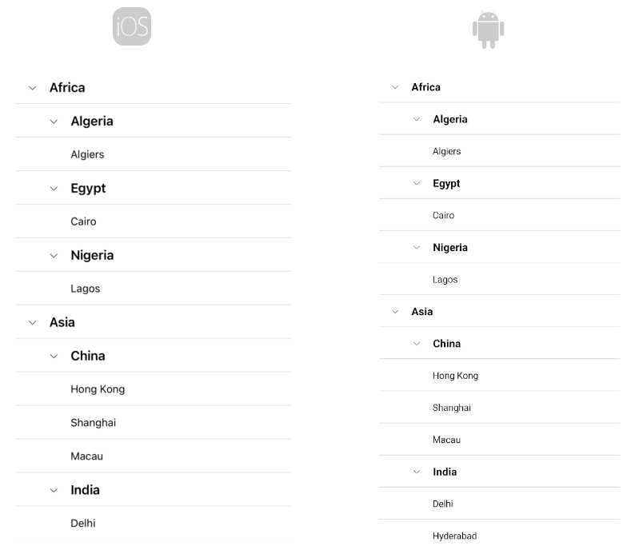

# .NET MAUI CollectionView Multi-Level Grouping

This article demonstrates how to enable multi-level grouping in the CollectionView control. The sample implementation below uses multiple `PropertyGroupDescriptor` definitions:

**1.** Define the following business object:

<snippet id='collectionview-datamodel' />

**2.** Create a `ViewModel` class as shown below:

<snippet id='collectionview-viewmodel' />

**3.** Add the `RadCollectionView` definition with two `PropertyGroupDescriptors` as shown in the next snippet:

<snippet id='collectionview-multilevel-grouping' />

**4.** Include the `telerik` namespace:

```XAML
xmlns:telerik="http://schemas.telerik.com/2022/xaml/maui" 
```

This is the result on desktop:


This is the result on mobile:



> For a runnable demo with the CollectionView Multi-Level Grouping, see the [SDKBrowser Demo Application]() and go to the **CollectionView > Grouping** category.

## See Also

- [PropertyGroup Descriptor]()
- [Delegate Group Descriptor]()
- [Group Header]()

