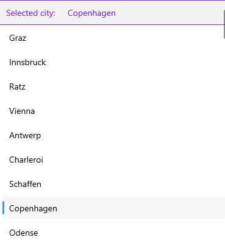

# .NET MAUI CollectionView Header and Footer

The .NET MAUI CollectionView provides the option to add `HeaderTemplate` and `FooterTemplate`, which allow you to position content of your choice above and below the list with the items. Both header and footer templates are scrolled along with the CollectionView items.

* `HeaderTemplate`(`DataTemplate`)&mdash;Defines the header of the CollectionView, rendered before all other items.
* `FooterTemplate`(`DataTemplate`)&mdash;Defines the footer of the CollectionView, rendered after all other items.

The following example shows how to add a header and a footer to the CollectionView control.

**1.** Add the `CollectionView` instance with the `HeaderTemplate` and `FooterTemplate` applied:

<snippet id='collectionview-header-footer'/>

**2.** Add a sample `ViewModel` class with a list of `DataModel` objects which is used as a `BindingContext` of the `CollectionView`:

<snippet id='collectionview-viewmodel'/>

**3.** Add the `DataModel` class:

<snippet id='collectionview-datamodel'/>

The following image shows how the CollectionView header looks.

The following image shows how the CollectionView footer looks.

## See Also

- [Selection]()
- [Scrolling]()
- [Pull To Refresh]()
