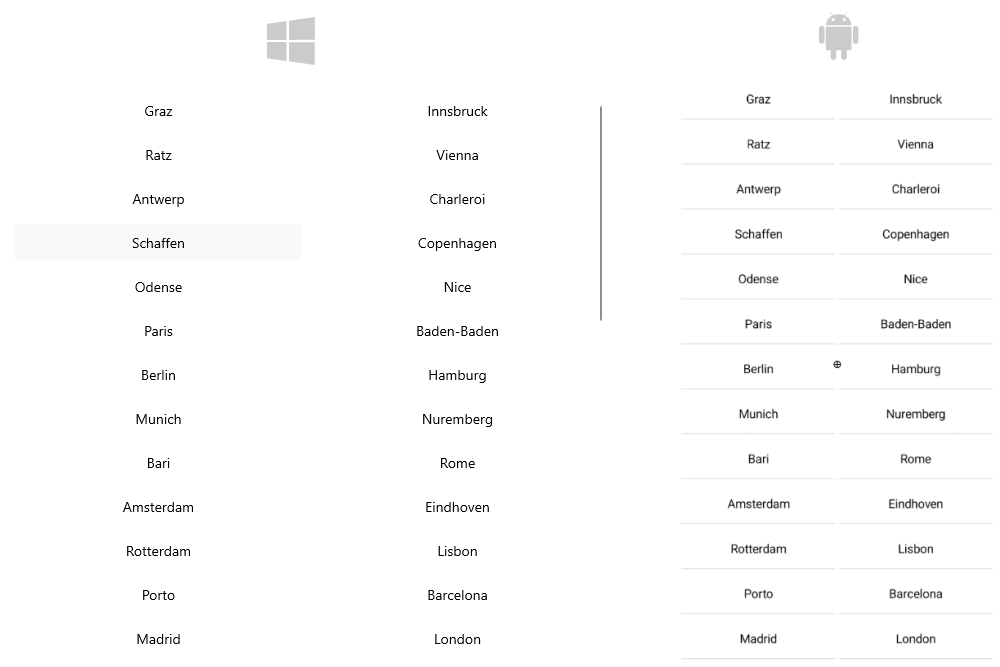

# .NET MAUI CollectionView Grid Layout

The CollectionView control provides a grid-like layout that you can specify by using the `ItemsLayout` property. The `ItemsLayout` property accepts values of type `CollectionViewLayoutBase`, which is a base class.

The grid layout allows distributing cells in a fixed number of columns and rows. To set the grid layout, create an instance of the `CollectionViewGridLayout` class and assign it to the `RadCollectionView.ItemsLayout` property.

The following code snippet represents a sample `RadCollectionView` definition with `CollectionViewGridLayout`:

```XAML
<telerik:RadCollectionView>
    <telerik:RadCollectionView.ItemsLayout>
        <telerik:CollectionViewGridLayout />
    </telerik:RadCollectionView.ItemsLayout>
</telerik:RadCollectionView>
```

This is how the items are arranged when you define a grid layout:



The `CollectionViewGridLayout` provides the following properties:

* `SpanCount` (`int`)&mdash;Specifies the count of the columns or rows (depending on the orientation) of the layout. The value must be `>= 1`. The default value is `2`.
* `HorizontalItemSpacing` (`double`)&mdash;Specifies the horizontal empty space around each item. The default value is `0.0`.
* `VerticalItemSpacing` (`double`)&mdash;Specifies the vertical empty space around each item. The default value is `0.0`.
* `Orientation` (enum or type `Telerik.Maui.Orientation`)&mdash;Specifies the orientation of the layout. The available options are: `Horizontal` and `Vertical` (default).

## Example with Grid Layout

The following example demonstrates how to apply the grid layout to the `RadCollectionView`.
 
**1.** Define the following business object:

<snippet id='collectionview-datamodel' />

**2.** Create a `ViewModel` class as shown below:

<snippet id='collectionview-viewmodel' />

**3.** Add the `RadCollectionView` definition with the grid layout:

<snippet id='collectionview-grid-layout' />

**4.** Include the `telerik` namespace:

```XAML
xmlns:telerik="http://schemas.telerik.com/2022/xaml/maui" 
```

This is the result:


> For a runnable demo with the CollectionView `CollectionViewGridLayout`, see the [SDKBrowser Demo Application]() and go to the **CollectionView > Layouts** category.

## See Also

- [Grouping]()
- [Sorting]()
- [Selection]()
- [Commands]()