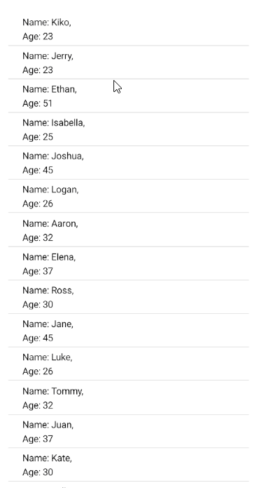

# .NET MAUI CollectionView Pull to Refresh

Some lists contain items that may change after the initial load. The _pull-to-refresh_ functionality allows the user to manually trigger an update of the list.

You can achieve a pull-to-refresh functionality in Telerik .NET MAUI CollectionView by using the <a href="https://learn.microsoft.com/en-us/dotnet/maui/user-interface/controls/refreshview?view=net-maui-8.0" target="_blank">Microsoft .NET MAUI `RefreshView`</a>.

## Example 

The following example demonstrates how to use the .NET MAUI `RefresView` with `RadCollectionView`.

**1.** Define the `RefreshView` and `RadCollectionView` in XAML:

<snippet id='collectionview-pull-to-refresh-xaml'/>

**2.** Add the following namespaces:

```XAML
xmlns:telerik="http://schemas.telerik.com/2022/xaml/maui"
```

**3.** Define a sample business model:

<snippet id='collectionview-grouptapcommand-model'/>

**4.** Add the `ViewModel`:

<snippet id='collectionview-pull-to-refresh'/>

This is the result on Android:



## See Also

- [Grouping]()
- [Filtering]()
- [Selection]()
- [Commands]()