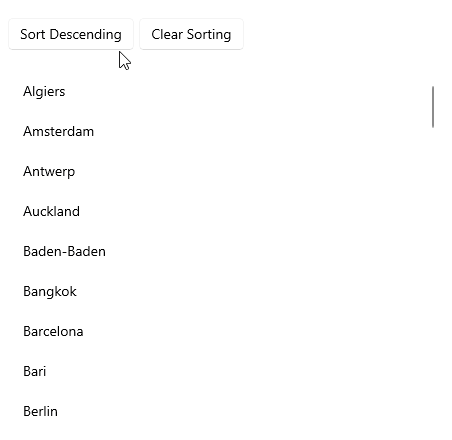

# .NET MAUI CollectionView Sorting

The CollectionView control allows you to sort the visualized data. To configure the Sorting feature, add different `SortDescriptors` to the `SortDescriptors` collection of the CollectionView.

## Property Sort Descriptor

You can sort the data by a property value from the class that defines your business items. The `PropertySortDescriptor` exposes the following properties:

- `PropertyName`&mdash;Defines the string name of the property that is used to retrieve the key to sort by.
- `SortOrder`&mdash;Specifies sort order to ascending or descending.

The following example demonstrates how to define the `PropertySortDescriptor`.

**1.** Define the `RadCollectionView` in XAML:

<snippet id='collectionview-property-sort-descriptor'/>

**2.** Add the `telerik` namespace:

```XAML
xmlns:telerik="http://schemas.telerik.com/2022/xaml/maui"
```

**3.** Create a sample `DataModel`:

<snippet id='collectionview-datamodel' />

**4.** Define the `ViewModel` class:

<snippet id='collectionview-viewmodel' />

This is the result:



> For a runnable demo with the CollectionView Sorting example, see the [SDKBrowser Demo Application]() and go to the **CollectionView > Sorting** category.

## Delegate Sort Descriptor

The difference between the `DelegateSortDescriptor` and the `PropertySortDescriptor` is that the `DelegateSortDescriptor` sorts the data by a custom key, while the `PropertySortDescriptor` sorts the data by a defined key, which is a property from the model.

The `DelegateSortDescriptor` exposes the following properties:

* `KeyLookup`&mdash;Gets or sets the `IKeyLookup` instance that is used to retrieve the sort key for each data item.
* `SortOrder`&mdash;Gets or sets the order of the sorting (ascending or descending).

To use a `DelegateSortDescriptor`, create a class that implements the `IKeyLookup` interface which will return the key by which you want to sort. Then, add the `DelegateSortDescriptor` to the `RadCollectionView.SortDescriptors` collection and set its `KeyLookUp` property.


## See Also

- [Grouping]()
- [Filtering]()
- [Selection]()
