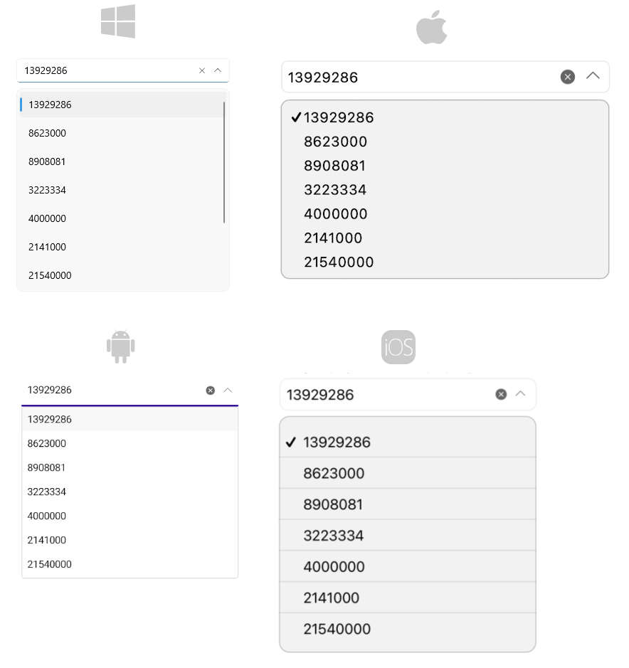

# Getting Started with the .NET MAUI ComboBox

This guide provides the information you need to start using the [Telerik UI for .NET MAUI ComboBox]() by adding the control to your project.

## Prerequisites

Before adding the ComboBox, you need to:

1. [Set up your .NET MAUI application](#step-1-set-up-your-net-maui-application).

1. [Download Telerik UI for .NET MAUI](#step-2-download-telerik-ui-for-net-maui).

1. [Install Telerik UI for .NET MAUI](#step-3-install-telerik-ui-for-net-maui).

1. [Register Required Handlers](#step-4-register-required-handlers).

## Define the Control

When your .NET MAUI application is setup, you are ready to add a ComboBox control to your page. The following example demonstrates the definition of the `RadComboBox` with `ItemsSource` set to a static collection as well as bound to property from a ViewModel class.

### Using Static Data

<snippet id='combobox-getting-started-static-items-xaml'/>

Here is the result:


### Binding to a Complex Object

**1.** Define the ComboBox in XAML:

<snippet id='combobox-getting-started-complex-object-xaml'/>

> When binding to complex objects, always set the ComboBox `DisplayMemberPath` property.

**2.** Add the `telerik` namespace:

 ```XAML
xmlns:telerik="http://schemas.telerik.com/2022/xaml/maui"
 ```

**3.** Define a sample business model:

<snippet id='combobox-city-businessmodel'/>

**4.** Add the ViewModel:

<snippet id='combobox-cities-viewmodel'/>

**5.** Set the binding context after `InitializeComponent()` in the page's code behind:

```C#
this.BindingContext = new ViewModel();
```

Here is the result:



> For the ComboBox Getting Started example, refer to the [SDKBrowser Demo Application]() and navigate to the **ComboBox > Getting Started** category.

## Additional Resources

- [.NET MAUI ComboBox Product Page](https://www.telerik.com/maui-ui/checkbox)
- [.NET MAUI ComboBox Forum Page](https://www.telerik.com/forums/maui?tagId=1937)
- [Telerik .NET MAUI Blogs](https://www.telerik.com/blogs/mobile-net-maui)
- [Telerik .NET MAUI Roadmap](https://www.telerik.com/support/whats-new/maui-ui/roadmap)

## See Also

- [Configuration]()
- [Data Binding]()
- [Edit Mode & Search]() 
- [Single and Multiple Selection]()
