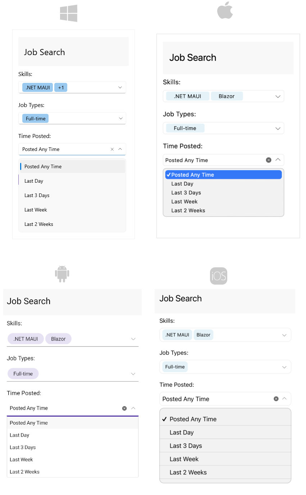

# .NET MAUI ComboBox Overview

The Telerik UI for .NET MAUI ComboBox allows users to select item/items from a drop down list of items. The control has a number of features such as searching, single and multiple selection, flexible styling API, dropdown customizations and more.  

## Key Features

* [Editable and NonEditable mode]()—ComboBox supports both editable and noneditable state. When the control is in edit mode searching can be performed. 
* [Searching Support]() – ComboBox provides both case-sensitive and case-insensitive searching modes. The available options are: `Contains`, `StartsWith`, `ContainsCaseSensitive` and `StartsWithCaseSensitive`. 
* [Single and Multiple Selection Support]() – ComboBox control has a support for single and multiple selection. You can specify the required selection using the `SelectionMode` property.
* [Complex Object Support]() – ComboBox control provides you a way to specify which property of your complex business object to be displayed in the control by setting `DisplayMemberPath`.
* [Search Highlighting Text]() – ComboBox control highlights the matching text inside the dropdown list based on the given input after searching is performed.
* [Placeholder](#placeholder) – The text which is used to give guidance to the end user on what can be entered/searched in the input. The watermark text is displayed when the input field is empty, or the selected item/s is/are cleared.
* [Header and Footer]() – ComboBox for .NET MAUI gives you the ability to add header and footer inside the dropdown list. For this purpose, you will need to define the `HeaderTemplate` property and the `FooterTemplate` property. 
* [Clear button visibility](#clearbutton-visibility)&mdash;Specify whether the button which users can use to clear the selection will be visible or not. 
* [Customizable DropDown](#dropdown-behavior)&mdash;Apply height and width for the dropdown. Also specify whether the dropdown will be closed on selection or initially opened. 
* [Keyboard type](#keyboard)&mdash;Specify the type of the keyboard that is displayed on mobile by using the `Keyboard` property.
* UI Virtualization Support&mdash;ComboBox supports UI Virtualization which enables you to display large list of items. When the list (positioned inside the drop down part) is scrolled, the ComboBox reuses the existing items to display the relevant data instead of creating new ones.
* [Templates]() – You can change the default `ItemTemplate` and `SelectedItemTemplate`. In addition, if the ComboBox is in multiple selection mode, the selected item is displayed inside a token. You can customize the token using the `TokenTemplate` property. Also, you can customize the `ShowMoreTemplate` which is visualized inside the ComboBox when the control is not focused and when there isn't space for all tokens to be displayed. 
* [Commands Support]() – ComboBox for .NET MAUI exposes `ClearSelectionCommand` that allows you clear the selected item(s) from external UI and `SelectAllCommand` that allows you to select all items from the source.
* [Flexible Styling API]() – Allows you to change the ComboBox background color, style the control’s dropdown box, change the clear and dropdown buttons. In addition, you can change the Placeholder text color and the Highlighted text color.

## Next Steps

- [Getting Started with Telerik UI for .NET MAUI ComboBox]()

## See Also

- [Visual Structure]()
- [Getting Started]()
- [Configuration]()
- [Data Binding]()
- [Edit Mode & Search]() 
- [Single and Multiple Selection]()
- [Header and Footer]()
- [Templates]()
- [Styling]()
- [.NET MAUI ComboBox Product Page](https://www.telerik.com/maui-ui/checkbox)
- [.NET MAUI ComboBox Forum Page](https://www.telerik.com/forums/maui?tagId=1937)
- [Telerik .NET MAUI Blogs](https://www.telerik.com/blogs/mobile-net-maui)
- [Telerik .NET MAUI Roadmap](https://www.telerik.com/support/whats-new/maui-ui/roadmap)
