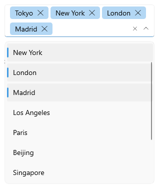

# .NET MAUI ComboBox Selection

The ComboBox for .NET MAUI enables the app users to quickly select item/items from the dropdown list. This topic will go through the provided by the ComboBox API related to item/items selection.

ComboBox control has a support for single and multiple selection. You can specify the required selection using the `SelectionMode` property.

## Main Properties

* `SelectionMode`(enumeration of type `Telerik.Maui.Controls.ComboBoxSelectionMode`)&mdash;Defines whether the selection is single or multiple.
* `SelectedIndex`(`int`)&mdash;Specifies the index of the first item in the current selection or -1 if the selection is empty.
* `SelectedItem`(`object`)&mdash;Defines the first item in the current selection, or null if the selection is empty.
* `SelectedItems`(`readonly ObservableCollection &lt;object &gt;`)&mdash;Gets the collection of currently Selected Items. 

> `SelectedItems` collection can be changed only when `SelectionMode` is `Multiple`. For `Single` `SelectionMode` use `SelectedItem`.

## Single Selection

The default `SelectinMode`(enumeration of type `Telerik.Maui.Controls.ComboBoxSelectionMode`) of the ComboBox control is `Single`.

### Example with Single Selection and SelectedIndex set

Here is the `RadComboBox` definition in XAML:

<snippet id='combobox-single-selection'/>

you need to add the following namespace:

 ```XAML
xmlns:telerik="http://schemas.telerik.com/2022/xaml/maui"
 ```

the sample business model

<snippet id='combobox-city-businessmodel'/>

and the ViewModel used:

<snippet id='combobox-singleselection-viewmodel'/>

This is how single selection looks:


### Example with Multiple Selection and SelectedItems set

Here is the ComboBox definition in XAML:

<snippet id='combobox-multiple-selection'/>


the sample business model

<snippet id='combobox-city-businessmodel'/>

and the ViewModel used:

<snippet id='combobox-multipleselection-viewmodel'/>

This is how multiple selection looks: 



>important The Selection example can be found in our [SDK Browser Application](). You can find the applications in the **Examples** folder of your local **Telerik UI for .NET MAUI** installation or in the following [GitHub repo](https://github.com/telerik/maui-samples/tree/main/Samples/SdkBrowser).

## Events

ComboBox exposes a `SelectionChanged` event which is raised when item is selected.

The `SelectionChanged` event handler receives two parameters:

- The `sender` which is the RadComboBox control.
- `ComboBoxSelectionChangedEventArgs` provides the following properties:
	- `AddedItems`: the items added to the SelectedItemsCollection
	- `RemovedItems`: the items removed from the SelectedItemsCollection

## Commands

ComboBox has two commands related to the Selection feature:

- `SelectAllCommand`(`ICommand`)&mdash;Selects all items from the source.
- `ClearSelectionCommand`(`ICommand`)&mdash;Sets the selection to null. If Multiple SelectionMode is used, this command will clear all selected items.

## See Also

- [Configuration]()
- [Data Binding]()
- [Edit Mode & Search]() 
- [Templates]()
