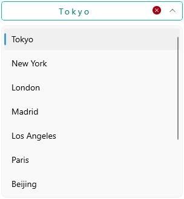

# Styling

ComboBox control for .NET MAUI provides the following Style properties for customizing its look:

* `PlaceholderColor`(`Microsoft.Maui.Graphics.Color`): Defines the color for the placeholder text.
* `TextColor`(`Microsoft.Maui.Graphics.Color`): Defines the color of the text when the control is editable and color of the selected item when it is not editable and selection mode is single.
* `BackgroundColor`(`Microsoft.Maui.Graphics.Color`): Defines the background color of the control.
* `BorderColor`(`Microsoft.Maui.Graphics.Color`): Defines the color of the border.
* `BorderThickness`(`Microsoft.Maui.Thickness`): Defines the thickness of the border.
* `ClearButtonStyle`(of type `Style` with target type `Telerik.Maui.Controls.RadButton`): Defines the style for the clear button.
* `Font Options`(`FontAttributes`, `FontFamily`, `FontSize`): Define the font options to the text of the RadComboBox. It is applied to the Placeholder, Selected Text(for single selection) and when the control is in Editable Mode.

### Example for ComboBox Styling

Here is the ComboBox definition in XAML:

<snippet id='combobox-styling'/>

in addition you will need to add the `telerik` namespace:

```XAML
xmlns:telerik="http://schemas.telerik.com/2022/xaml/maui"
```

the sample business model

<snippet id='combobox-city-businessmodel'/>

and the ViewModel used:

<snippet id='comobobox-editing-viewmodel'/> 

Here is how the Combobox looks when styling is applied:


Here is how the styling is applied when the control is focused and item is selected:



> For the ComboBox Styling example, go to the [SDKBrowser Demo Application]() and navigate to ComboBox -> Styling category.

## DropDown Styling

The following properties styles the ComboBox Drop Down:

* `DropDownBorderColor`(`Microsoft.Maui.Graphics.Color`): Defines the color of the border around the drop down part of the control.
* `DropDownBorderThickness`(`Microsoft.Maui.Thickness`): Defines the thickness of the border that is around of the drop down part of the control.
* `DropDownBorderCornerRadius`(`Microsoft.Maui.Thickness`): Defines the corner radius of the border that is around the drop down part of the control
* `DropDownBackgroundColor`(`Microsoft.Maui.Graphics.Color`): Defines the background color of the drop down part of the control.
* `DropDownButtonStyle`(of type `Style` with target type `Telerik.Maui.Controls.RadButton`): Defines the style for the drop down button.

### Example for DropDown Styling

Here is the ComboBox definition in XAML:

<snippet id='combobox-dropdown-styling'/>

add the following namespace:

<snippet id='xmlns-telerikinput'/>

The DropDown Button Style is defined in the Page's ResourceDictionary:

<snippet id='combobox-dropdownbutton-style'/>

the sample business model

<snippet id='combobox-city-businessmodel'/>

and the ViewModel used:

<snippet id='comobobox-editing-viewmodel'/> 

Here is how the Drop Down Styling looks:


> For the ComboBox DropDown Styling example, go to the [SDKBrowser Demo Application]() and navigate to ComboBox -> Styling category.

## See Also

- [Configuration]()
