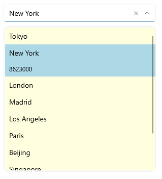

# .NET MAUI ComboBox Templates

If the default templates of the control do not suit your needs, you can easily define custom ones. The available templates for customizing are:

* `ItemTemplate`(`DataTemplate`)&mdash;Defines the template of the items that are visualized in the dropdown list.

> When the selection mode is single and the control is not editable if there is ItemTemplate set the same template will be visualized in the box part of the control when item is selected.

* `SelectedItemTemplate`(`DataTemplate`)&mdash;Defines the template of the selected items that are visualized in the dropdown list.
* `TokenTemplate`(`DataTemplate`)&mdash;Defines the template of the tokens that are visualized when multiple selection is performed.
* `ShowMoreTemplate`(`DataTemplate`)&mdash;Defines the Template of the show more UI that gets visualized when the control is not focused and there is not enough space for all Tokens to be visualized when the selection mode is multiple.
* `SelectionBoxTemplate`(`DataTemplate`)&mdash;Defines the template of the selected item in the box section of the control. This property is only available when the RadComboBox is non-editable(IsEditable set to "false").

### Example with ItemTemplate and SelectedItemTemplate

Here is the ComboBox definition in XAML:

<snippet id='combobox-item-selecteditem-templates'/>

you need to add the `telerik` namespace:

```XAML
xmlns:telerik="http://schemas.telerik.com/2022/xaml/maui"
```

the sample business model

<snippet id='combobox-city-businessmodel'/>

and the ViewModel used:

<snippet id='combobox-cities-viewmodel'/>

The final result: 



> For the ComboBox Item and SelectedItem Templates example, go to the [SDKBrowser Demo Application]() and navigate to ComboBox -> Templates category.

### Example with TokenTemplate and ShowMoreTemplate

Here is the ComboBox definition in XAML:

<snippet id='combobox-tokentemplate'/>

Add the sample business model

<snippet id='combobox-city-businessmodel'/>

and the ViewModel used:

<snippet id='combobox-cities-viewmodel'/>

> when the default TokenTemplate is overridden, you will need to implement custom logic for removing the tokens from the ComboBox:

here is a sample logic removing the token when adding TapGestureRecognizer to the Label:

<snippet id='remove-the-selecteditem'/>

Here is the how the Token and ShowMore Templates look:


> For the ComboBox TokenTemplate and ShowMoreTemplate example, go to the [SDKBrowser Demo Application]() and navigate to ComboBox -> Templates category.

## See Also

- [Configuration]()
- [Header and Footer]()
- [Edit Mode & Search]() 
- [Single and Multiple Selection]()
- [Styling]()
