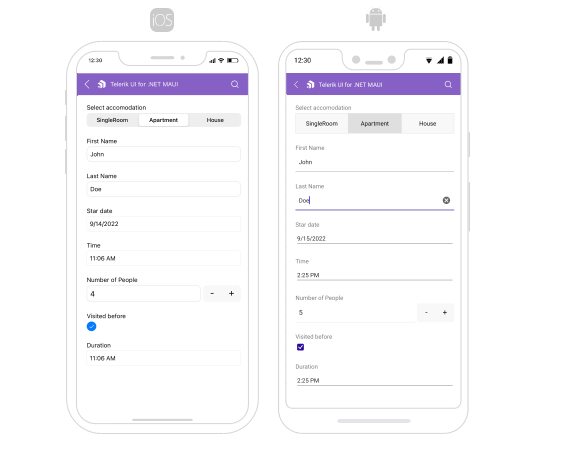

# Data Binding

One way to set data form source is to use a class and decorate its properties with data annotations. These data annotations are used to build metadata for each property used by the data form to customize its UI.

The Editors and Groups are automatically generated by default. If you want to prevent this set the DataForm `AutoGenerateItems` property to `False`.

>important DataForm gets the data from the BindingContext set. 

## Auto-generated items

Use the following business model

<snippet id='dataform-gettingstarted-model'/>

DataForm definition with BindingContext set:

<snippet id='dataform-gettingstarted-xaml'/>

## Manually generated items

<snippet id='dataform-editors-model'/>

RadDataForm definition with BindingContext set and `AutoGenerateItems="False"`:

<snippet id='dataform-editors'/>

## See Also

- [Editors]()
- [Grouping]()
- [Headers]()
- [Layouts]()
- [Commit Data]()
- [Commands]()