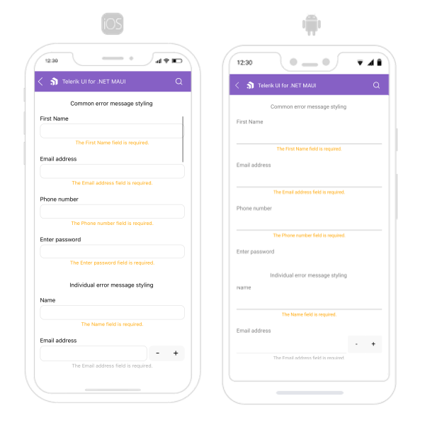

# .NET MAUI DataForm Error Message Styling

The DatePicker control for .NET MAUI provides styling options for customizing the appearance of the error message that appears when the entered data is invalid.

The style of the error message can be set individually for each editor or directly to the DataForm control using the following styling properties:

* `ErrorImageSource`(`ImageSource`)&mdash;Specifies the `ImageSource` of the image displayed in the error message.
* `ErrorImageStyle`(of type `Style` with target type `Image`)&mdash;Defines the error image style.
* `ErrorLabelStyle`(of type `Style` with target type `Label`)&mdash;Defines the error label style.

**1.** Defining two different `ErrorLabelStyle`:

<snippet id='dataform-error-label-style' />
<snippet id='dataform-error-label-style-alt' />

**2.** Apply common `ErrorLabelStyle` for all editors:

<snippet id='dataform-error-label-style-common' />

Note that `local` in the snippet above points to the namespace where the `DataTypeEditorsModel` is defined.

**3.** Apply `ErrorLabelStyle` per editor:

<snippet id='dataform-error-label-style-individual' />

Note that `local` in the snippet above points to the namespace where the `DataTypeEditorsModel` is defined.

**4.** Add the following namespace:

```XAML
xmlns:telerik="http://schemas.telerik.com/2022/xaml/maui"
```

**5.** The `ViewModel` used for the DataForm editors

<snippet id='dataform-datatype-editors-model'/>

The following image shows what the DataForm control looks like when the styles described above are applied:



> For a runnable example with the DataForm Error Message Styling scenario, see the [SDKBrowser Demo Application]() and go to **DataForm > Styling** category.

## See Also

- [Editors Styling]()
- [Groups Styling]()
- [Validation Styling]()
- [Header Styling]()