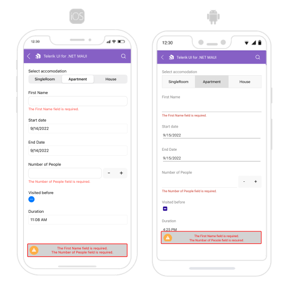

# .NET MAUI DataForm Validation

.NET MAUI DataForm provides built-in validation, which gives you full control over the data collected through the control. 


The next sections list all DataForm members related to validation.

## Validation Modes

The selected mode is applied through `ValidationMode` (of type`Telerik.Maui.Controls.DataFormValidationMode`) property of the DataForm control. You can choose between three validation modes:

* `Explicit`&mdash;The changes are validated explicitly by invoking the `ValidateCommand` or calling the `ValidateChanges` method of the DataForm.
* `LostFocus`&mdash;The changes are validated after the editor loses focus.
* `PropertyChanged`&mdash;The changes in the editor are validated immediately on each property change (when the property value changes).

>important When `ValidationMode` is `LostFocus`, you have to set `CommitMode` to `LostFocus` or `Explicit`.

The `ValidationMode` must be applied globally to the `RadDataForm`:

```XAML
<telerik:RadDataForm x:Name="dataForm"
                     ValidationMode="LostFocus"/>
```

## Validation Properties

* `HasValidationErrors`(`bool`)&mdash;Gets a value indicating whether it has validation errors.

## Events

DataForm exposes the following events for validation: 

* `ValidationCompleted`&mdash;Raised when the DataForm validation completes. The `ValidationCompleted` event handler receives two parameters:
	* `sender` argument which is of type object, but can be cast to the `RadDataForm` type. 
	* `DataFormObjectValidationCompletedEventArgs` which provides additional information for the validated `DataObject`, the `ValidationErros`(`IReadOnlyList` of `DataFormValidationError`) and whether it has validation errors `HasValidationErrors`(`bool`).

* `EditorValidationCompleted`&mdash;Raised when the validation of an editor has completed. The `EditorValidationCompleted` event handler receives two parameters:
    * `sender` argument which is of type object, but can be cast to the `RadDataForm` type. 
    * `DataFormEditorValidationCompletedEventArgs`  which provides additional information for the validated `PropertyName`, the original value ff the validated property `PropertyValue`(`object`) in the model and the modified value of the validated property in the editor - `EditorValue`(`object`).


## Manual Validation with Methods

DataForm exposes a `ValidateChanges` method with two overloads:

* `ValidateChanges()`&mdash;Executes the validation logic associated with the DataForm control. This method is useful when the `ValidationMode` is `Explicit`. The method returns `true` if the validation passes, otherwise `false`.

<snippet id='dataform-validatechanges'/>

* `ValidateChanges(string propertyName)`&mdash;Validates the pending changes in the editor for the specified property. This method is useful when the DataForm `ValidationMode` property is `Explicit`. `True` if the validation passes, `false` otherwise.

<snippet id='dataform-validatechanges-on-property'/>

> For a runnable example with the DataForm Validation scenario, see the [SDKBrowser Demo Application]() and go to **DataForm > Validation** category.

## Commands

* `ValidateCommand`(`ICommand`)&mdash;Gets a command to execute the validation logic of the `RadDataForm`. This command is useful when the DataForm `ValidationMode` property is `Explicit`.

## Validation Summary - Styling and Customization

The `ValidationSummaryMessage` displays all validation messages for the editors. You can visualize/hide the validation summary message by setting the `IsValidationSummaryVisible`(`bool`) property to `True`/`False`.

You can use the following properties for validation styling and customization:

* `ValidationSummaryImageSource`(`ImageSource`)&mdash;Specifies the `ImageSource` of the image displayed in the validation summary.
* `ValidationSummaryImageStyle`(`Style`)&mdash;Specifies the style applied to the image of the validation summary. The target type of this style is the .NET MAUI `Image` control.
* `ValidationSummaryStyle`(`Style`)&mdash;Specifies the style applied to the validation summary. The target type of this style is the `Telerik.Maui.Controls.DataFormValidationSummaryView`.         
* `ValidationSummaryLabelStyle`(`Style`)&mdash;Specifies the style applied to the labels of the validation summary. The target type of this style is the .NET MAUI `Label` control.



## Error Message - Styling and Customization

You can use the following properties for error message styling and customization:

* `ErrorImageSource`(`ImageSource`)&mdash;Specifies the `ImageSource` of the image displayed in the error message.
* `ErrorImageStyle`(`Style`)&mdash;Specifies the style applied to the image of the error message. The target type of this style is the .NET MAUI `Image` control.
* `ErrorLabelStyle`(`Style`)&mdash;Specifies the style applied to the labels of the error message. The target type of this style is the .NET MAUI `Label` control.


## Runtime Validation

If you want to add the validation runtime, when editors are generated, then you have to use the `EditorsGenerated` event. Inside the event you can define the validation. 

The following table lists the available DataForm validations:

| DataForm Validation Rule | Definition |
| ----- | ------ |
| (DataForm level) `DataFormObjectValidationRule` | Represents a custom validation rule of the DataForm control. |
| `DataFormEditorCustomValidationRule` | Represents a custom validation rule for the editor. The validation rule can execute a custom validation logic on the underlying business object.|
| `DataFormEditorLengthValidationRule` | Validates that the string length of the current value is between the specified minimum and maximum length. |
| `DataFormEditorRangeValidationRule` | Validates that the current value is between the specified minimum and maximum value. |
| `DataFormEditorRegexValidationRule` | Executes a custom regular expression to validate the current string value. |
| `DataFormEditorRequiredValidationRule` | Validates that the current value is not null or an empty string. |

> When using runtime validation approach and you have defined a validation to the `ViewModel` (by setting the data annotations)&mdash;the validation defined in the `ViewModel` will be applied instead of the runtime validation. The [Data Annotation Validation]() is with higher priority.

Here is an example for runtime validation using the `EditorGenerated` event:

```C#
var form = new RadDataForm();
form.EditorGenerated += this.OnEditorGenerated;
```

```C#
private void OnEditorGenerated(object sender, DataFormEditorGeneratedEventArgs eventArgs)
{
	switch (eventArgs.PropertyName)
	{
		case "FirstName":
			eventArgs.Editor.HeaderText = "First Name";
			// This won't be applied on FirstName property, as there is a validation set by using the DataAnnotations
			eventArgs.Editor.ValidationRules.Clear();
			break;
		case "LastName":
			eventArgs.Editor.HeaderText = "Last Name";
			// Add validation rule here
			eventArgs.Editor.ValidationRules.Add(new DataFormEditorRequiredValidationRule
			{

			});
			break;
		case "StartDate":
			eventArgs.Editor = new DataFormRadDatePickerEditor
			{
				PropertyName = "StartDate",
				HeaderText = "Start Date"
			};
			break;
		case "EndDate":
			// we remove the editor for this property
			eventArgs.Editor = null;
			break;
		case "Accommodation":
			eventArgs.Editor = new DataFormRadComboBoxEditor
			{
				PropertyName = "Accommodation",
				HeaderText = "Accommodation",
			};
			break;
	}
}
```

## See Also

- [Editors]()
- [Grouping]()
- [Headers]()
- [Layouts]()
- [Commit Data]()
- [Commands]()
