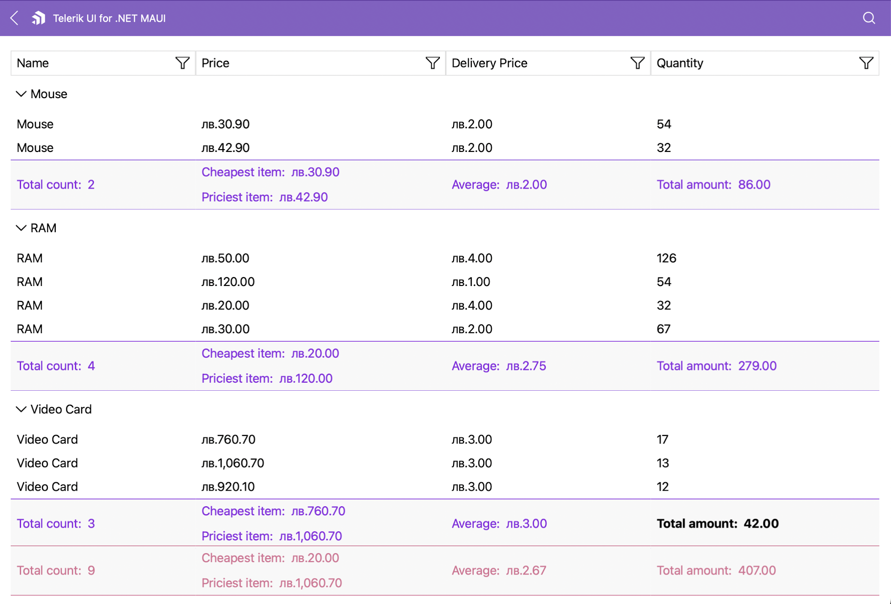

# .NET MAUI DataGrid Aggregates Styling

The .NET MAUI DataGrid provides a styling functionality for its Group Footer, Header and Column Footer aggregates.

Use the following properties to style the aggregates:

* `GroupHeaderStyle`(`DataGridGroupHeaderStyle`)&mdash;Defines the style of the `GroupHeader` and the aggregates inside the header.
* `GroupFooterStyle`(`DataGridGroupFooterStyle`)&mdash;Defines the style of the `GroupFooter` and the aggregates inside the footer.
* `GroupFooterStyleSelector`(`DataGridStyleSelector`)&mdash; Defines the style of the selected GroupFooter by passing the `GroupFooterContext` in the selector.
* `FooterStyle`(`DataGridColumnFooterStyle`)&mdash;Defines the style of the Column Footer and the aggregates inside the Column Footer. 

> To visualize the GroupFooter, set the `ShowGroupFooters` property to `True`. The property is a property inside the RadDataGrid.

> To visualize the GroupHeader, set the `ShowGroupHeaderAggregates` to `True`. The property is a property inside the RadDataGrid.

## Apply style in the group footer

The following example shows how to define the GroupFooterStyle in XAML:

<snippet id='datagrid-group-aggregate-styling-example'/>

## GroupFooterStyleSelector

The following example shows how to use the `GroupFooterStyleSelector` property.

Define the class to which the `GroupFooterContext` will be passed.

<snippet id='datagrid-group-aggregate-style-selector'/>

Define the style selector which will passed to the DataGrid in XAML.

<snippet id='datagrid-group-aggregate-style-selector-xaml'/>

The final result is as follows:

