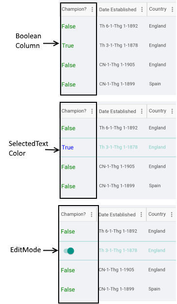

# DataGrid BooleanColumn

The `DataGridBooleanColumn` is used to represent boolean values. It uses the CheckBox control to edit its values in EditMode.

## Important Properties

* `PropertyName`&mdash;Specifies the name of the property of the object type that represents each row within the grid.
* `HeaderText`&mdash;Defines the content that will be displayed in the Header UI that represents the column.
* `CellContentStyle`&mdash;Defines the `Style` object that sets the appearance of each cell associated with this column. The `TargetType` of the `Style` has to be of the `TextBlock` type.
* `CellContentStyleSelector`&mdash;Defines the `StyleSelector` instance that allows for the dynamic appearance on a per-cell basis.
* `CellContentFormat`&mdash;Defines the custom format for each cell value. The `String.Format` routine is used and the format passed has to be in the form required by this method.
* `CellContentTemplate` (`DataTemplate`)&mdash;Defines the appearance of each cell associated with the concrete column. The `CellContenTemplate` enables you to wrap the text inside each DataGrid column. You can add a Label as a content of the Text and Template Column and wrap its text using the `LineBreakMode` Label property.
* `CellEditTemplate` (`DataTemplate`)&mdash;Defines the editor associated with the concrete column. The `CellEditTemplate` is displayed when the cell is in edit mode.

>tip For more information about `CellDecorationStyle` and  `CellDecorationStyleSelector`, refer to the [Columns Styling]() topic.

>important `CellContentFormat` uses the format string provided by the framework. For more details, refer to the [`String.Format`](https://docs.microsoft.com/en-us/dotnet/api/system.string.format?view=netframework-4.8) article.

## Example

```XAML
<telerik:DataGridBooleanColumn PropertyName="IsChampion"
                                    HeaderText="Champion?">
    <telerik:DataGridBooleanColumn.CellContentStyle>
        <telerik:DataGridTextCellStyle TextColor="Green"
                                            FontSize="18"
                                            SelectedTextColor="Blue" />
    </telerik:DataGridBooleanColumn.CellContentStyle>
</telerik:DataGridBooleanColumn>
```



## See Also

- [Columns Styling]()
- [Text Column]()
- [Numerical Column]()
