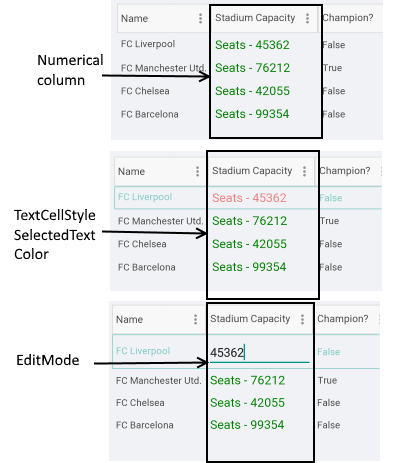

# DataGrid NumericalColumn

The `DataGridNumericalColumn` is used to represent only numerical values. It uses the Telerik UI for .NET MAUI [NumericInput control]() to edit the value in EditMode. The difference between this column and the text one is that it will directly invoke the numeric keyboard on the mobile devices.

## Important Properties

* `PropertyName`&mdash;Specifies the name of the property of the object type that represents each row within the grid.
* `HeaderText`&mdash;Defines the content that will be displayed in the Header UI that represents the column.
* `CellContentStyle`&mdash;Defines the `Style` object that sets the appearance of each cell associated with this column. The `TargetType` of the `Style` has to be of the `TextBlock` type.
* `CellContentStyleSelector`&mdash;Defines the `StyleSelector` instance that allows for the dynamic appearance on a per-cell basis.
* `CellContentFormat`&mdash;Defines the custom format for each cell value. The `String.Format` routine is used and the format passed has to be in the form required by this method.
* `CellContentTemplate` (`DataTemplate`)&mdash;Defines the appearance of each cell associated with the concrete column. `CellContenTemplate` enables you to wrap the text inside each DataGrid column. You can add a Label as a content of the Text and Template Column and wrap its text using the `LineBreakMode` Label property.
* `CellEditTemplate` (`DataTemplate`)&mdash;Defines the editor associated with the concrete column. The `CellEditTemplate` is displayed when the cell is in edit mode.

>tip For more information about `CellDecorationStyle` and  `CellDecorationStyleSelector`, refer to the [Columns Styling]() topic.

>important `CellContentFormat` uses the format string provided by the framework. For more details, refer to the [Standard Numeric Formatting](https://docs.microsoft.com/en-us/dotnet/standard/base-types/standard-numeric-format-strings) and [Custom Numeric Formatting](https://docs.microsoft.com/en-us/dotnet/standard/base-types/custom-numeric-format-strings) articles.

## Example

```XAML
<telerik:DataGridNumericalColumn PropertyName="StadiumCapacity"
                                     HeaderText="Stadium Capacity"
                                     CellContentFormat=" Seats - {0:D}">
    <telerik:DataGridNumericalColumn.CellContentStyle>
        <telerik:DataGridTextCellStyle TextColor="Green"
                                           FontSize="18"
                                           SelectedTextColor="LightCoral" />
    </telerik:DataGridNumericalColumn.CellContentStyle>
</telerik:DataGridNumericalColumn>
```



## See Also

- [Columns Styling]()
- [Boolean Column]()
- [Date Column]()
