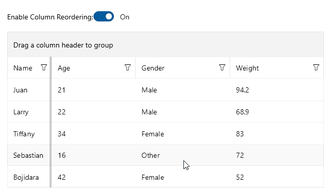
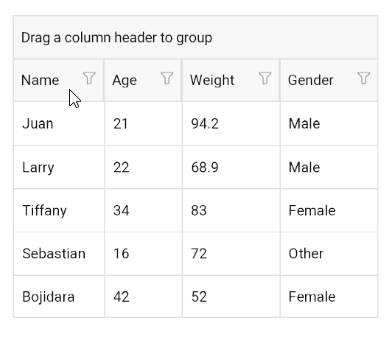

# .NET MAUI DataGrid Columns Reordering

The [.NET MAUI DataGrid]() exposes a reordering feature allowing the user to drag and drop columns and change their order.


The following properties are relted to the reordering feature:

* `CanUserReorderColumns`(`bool`)&mdash;Defines whether the user can reorder the `DataGridColumns`. The default value is `true`.
* `ColumnReorderIndicatorTemplate`(`DataTemplate`)&mdash;Defines the template that presents the indicator that is displayed between two columns during reordering.
* `ColumnHeaderDragVisualTemplate` (`DataTemplate`)&mdash;Specifies the template that presents the drag visual of the dragged column header.

## Events

The DataGrid exposes the following events related to the reordering operation:

* `ColumnReorderStarting`&mdash;Raised when the user starts to drag a column to reorder it. The `ColumnReorderStarting` event handler receives the following parameters:
    - A `sender` argument, which is of type `object`, but can be cast to the `RadDataGrid` type.
    - A `ColumnReorderStartingEventArgs` object, which has a reference to the following properties:
        - `Column` (`DataGridColumn`)&mdash;Gets the column that will be reordered.
        - `Index` (`int`) &mdash;Gets the index of the column that will be reordered. The `Index` is the index of the item inside the `FrozenColumns` or `UnfrozenColumns` collection, depending on the value of `Column.IsFrozen`.
        - `Cancel` (`bool`)&mdash;Defines a value indicating whether the reordering operation is canceled.

* `ColumnReordering`&mdash;Raised continuously while the column is being dragged. The `ColumnReordering` event handler receives the following parameters:
    - A `sender` argument, which is of type `object`, but can be cast to the `RadDataGrid` type.
    - A `ColumnReorderingEventArgs` object, which has a reference to the following properties:
        - `Column` (`DataGridColumn`)&mdash;Gets the column that will be reordered.
        - `OldIndex` (`int`) &mdash;Gets the initial index of the column that is being reordered. The `OldIndex` is the old index of the item inside the `FrozenColumns` or `UnfrozenColumns` collection, depending on the value of `Column.IsFrozen`.
        - `NewIndex` (`int`) &mdash;Gets the new potential index of the column that is being reordered. The `NewIndex` is the new index of the item inside the `FrozenColumns` or `UnfrozenColumns` collection, depending on the value of `NewIsFrozen`.
        - `NewIsFrozen` (`bool`)&mdash;Gets the new potential `Telerik.Maui.Controls.DataGrid.DataGridColumn.IsFrozen` value of the column that is being reordered.
        - `CanDrop` (`bool`)&mdash;Defines a value indicating whether dropping the column at this specific location is allowed. The default value is `true`.

* `ColumnReorderCompleting`&mdash;Raised when the user drops the column. This doesn't mean the column is reordered. The `ColumnReorderCompleting` event handler receives the following parameters:
    - A `sender` argument, which is of type `object`, but can be cast to the `RadDataGrid` type.
    - A `ColumnReorderCompletingEventArgs` object, which has a reference to the following properties:
        - `Column` (`DataGridColumn`)&mdash;Gets the column that is being reordered.
        - `OldIndex` (`int`) &mdash;Gets the initial index of the column that is being reordered. The `OldIndex` is the old index of the item inside the `FrozenColumns` or `UnfrozenColumns` collection, depending on the value of `Column.IsFrozen`.
        - `NewIndex` (`int`) &mdash;Gets the new potential index of the column that is being reordered. The `NewIndex` is the new index of the item inside the `FrozenColumns` or `UnfrozenColumns` collection, depending on the value of `NewIsFrozen`.
        - `NewIsFrozen` (`bool`)&mdash;Gets the new potential `Telerik.Maui.Controls.DataGrid.DataGridColumn.IsFrozen` value of the column that is being reordered.
        - `IsDropAllowed` (`bool`)&mdash;Gets a value that indicates whether the column was dropped at a valid location. A valid location means that the column has changed its index and/or the value of its `IsFrozen` property and the drop at this location was not forbidden by setting the `Telerik.Maui.Controls.DataGrid.ColumnReorderingEventArgs.CanDrop` property of the `Telerik.Maui.Controls.DataGrid.ColumnReorderingEventArgs` to `false`. The default value is `true`.
        - `Cancel` (`bool`)&mdash;Defines a value indicating whether the reordering operation is canceled.

* `ColumnReordered`&mdash;Raised when a column has been successfully reordered. The `ColumnReordered` event handler receives the following parameters:
    - A `sender` argument which is of type `object`, but can be cast to the `RadDataGrid` type.
    - A `ColumnReorderCompletingEventArgs` object, which has a reference to the following properties:
        - `Column` (`DataGridColumn`)&mdash;Gets the column that has been reordered.
        - `OldIndex` (`int`) &mdash;Gets the initial index of the column that has been reordered. The `OldIndex` is the old index of the item inside the `FrozenColumns` or `UnfrozenColumns` collection, depending on the value of `OldIsFrozen`.
        - `OldIsFrozen` (`bool`)&mdash;Gets the initial `Telerik.Maui.Controls.DataGrid.DataGridColumn.IsFrozen` value of the column that has been reordered.
        - `NewIndex` (`int`) &mdash;Gets the new index of the column that has been reordered. The `NewIndex` is the new index of the item inside the `FrozenColumns` or `UnfrozenColumns` collection, depending on the value of `Column.IsFrozen`. 

## Example with Reorder Columns and Events

The following example shows how to bind the `CanUserReorderColumns` using MVVM and a sample scenario with the reordering events.

**1.** Create a sample model:

<snippet id='datagrid-persondetails' />

**2.** Create a `ViewModel`:

<snippet id='datagrid-reordering-viewmodel' />

**3.** Define the DataGrid and a control which will change the `CanUserReorderColumns` value in XAML:

<snippet id='datagrid-reordering-example'/>

**4.** Add the `telerik` namespace:

```XAML
xmlns:telerik="http://schemas.telerik.com/2022/xaml/maui"
```

**5.** Sample implementation in the reordering event:

<snippet id='datagrid-column-reordering-events'/>

The result on mobile:



## Example with Indicator Template when Reordering Columns

The following example shows how to define the `ColumnReorderIndicatorTemplate` in XAML:

**1.** Define the `DataTemplate` for the Indicator in the Resources of the page:

<snippet id='datagrid-reorder-indicator-template'/>

**2.** Define the `DataTemplate` for the header drag template in the Resources of the page:

<snippet id='datagrid-header-drag-template'/>

**3.** Define the `DataTemplate` for the group item template in the Resources of the page:

<snippet id='datagrid-grouping-panel-item-template'/>

**4.** Define the properties in the DataGrid:

<snippet id='datagrid-drag-templates'/>

**5.** Add the `telerik` namespace:

```XAML
xmlns:telerik="http://schemas.telerik.com/2022/xaml/maui"
```

**6.** Define sample data:

<snippet id='datagrid-persondetails' />

**7.** Define a sample `ViewModel`:

<snippet id='datagrid-reordering-viewmodel' />

The result on mobile:



> For the runnable DataGrid Drag Templates example, see the [SDKBrowser Demo Application]() and go to **DataGrid > Columns**.

## See Also

- [Picker Column]()
- [Template Column]()
- [Text Column]()