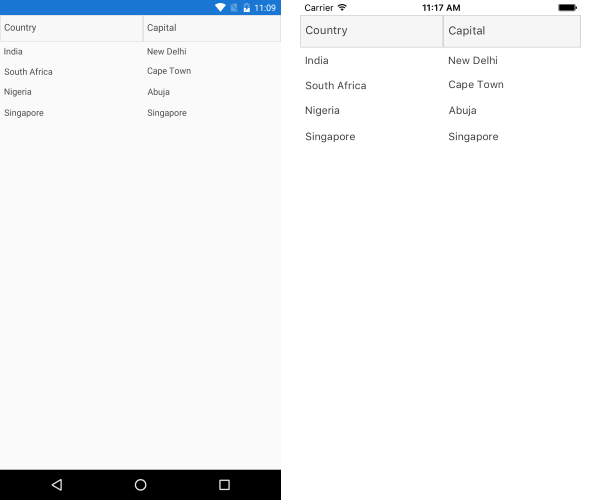

# Getting Started

>important RadDataGrid is rendered via the **SkiaSharp** graphics library.

## Define RadDataGrid control

The snippet below shows a simple RadDataGrid definition:

```XAML	
<telerikDataGrid:RadDataGrid x:Name="DataGrid"/>
```

In addition to this, you need to add the following namespace:

```XAML
xmlns:telerikDataGrid="clr-namespace:Telerik.XamarinForms.DataGrid;assembly=Telerik.XamarinForms.DataGrid"
```	

> RadDataGrid control provides UI virtualization, so it requires its visual parent to provide vertical or horizontal space for the control to fill into. The following scenarios will measure the control with infinity and the virtualization will not work:
>	* positioning the DataGrid control inside StackLayout which is wrapped in ScrollView.
>	* positioning the DataGrid inside ScrollView.

Now that you have added the control to your view, you need to make sure that is properly loaded with the required data. 

By default, the **RadDataGrid** control will autogenerate rows depending on the number of objects in the collection set as its **ItemsSource**. For the purpose of this article, we are going to use the following simple business objects:

```C#
public class Data
{
	public string Country { get; set; }

	public string Capital { get; set; }
}
```

After you have created your collection of custom objects, you should assign it to the **ItemsSource** property of the control:

```C#
this.DataGrid.ItemsSource = new List<Data>
{
	new Data { Country = "India", Capital = "New Delhi"},
	new Data { Country = "South Africa", Capital = "Cape Town"},
	new Data { Country = "Nigeria", Capital = "Abuja" },
	new Data { Country = "Singapore", Capital = "Singapore" } 
};
```

Here is the result:



## See Also

- [Columns]()
- [Grouping]()
- [Sorting]()