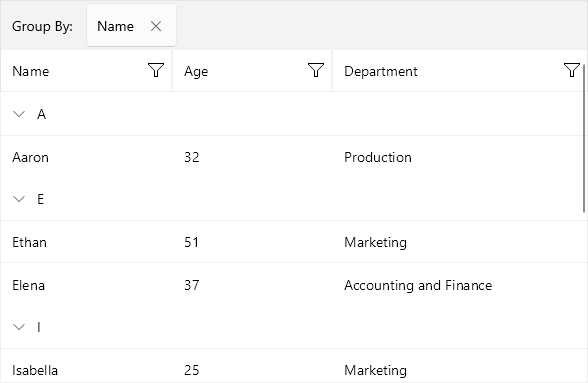

# Delegate Group Descriptor for .NET MAUI DataGrid

The difference between the `DelegateGroupDescriptor` and the [PropertyGroupDescriptor]() is that the `DelegateGroupDescriptor` groups data by a custom key, while the `PropertyGroupDescriptor` groups by a defined key which is a property from the model.

You have to set the `KeyLookup` property of the `DelegateGroupDescriptor`, which gets or sets the `IKeyLookup` instance that is used to retrieve the group key for each data item.

>note You can sort the groups in ascending or descending order by using the `SortOrder` property.

You have to create a class that implements the `IKeyLookup` interface which will return the key by which you want to group. Then, you need to add the `DelegateGroupDescriptor` to the `RadDataGrid.GroupDescriptors` collection and set its `KeyLookup` property.

The following example demonstrates a sample `IKeyLookup` implementation:

<snippet id='datagrid-grouping-delegategroupdescriptor-lookup' />

Add it to the `GroupDescriptors` collection of the `RadDataGrid` instance:

<snippet id='datagrid-grouping-delegategroupdescriptor' />

Here is how the [.NET MAUI DataGrid]() looks when is grouped through a `DelegateGroupDescriptor`:

