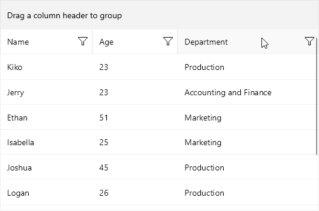

# .NET MAUI DataGrid Grouping UI



The [Telerik UI for .NET MAUI DataGrid]() provides a built-in grouping functionality, which allows the user to easily group the data by one or more columns.

The **DataGrid Grouping UI** exposes the `DataGridServicePanel` view which contains the `DataGridGroupingPanel` in itself. To group data, the user has to drag the desired column header to the `DataGridGroupingPanel` located at the top of the DataGrid.

> The user can drag more than one column into the panel.

## Configuration

To manipulate the state of the **Grouping UI**, you can use the following properties:

* `UserGroupMode`(`enum` of type `Telerik.Maui.Controls.Compatibility.DataGrid.DataGridUserGroupMode`) - The `UserGroupMode` property of the `RadDataGrid` determines whether the Grouping UI is enabled or disabled. The default value is `Auto`.
* `CanUserGroup`(`bool` of type `Telerik.Maui.Controls.Compatibility.DataGrid.DataGridColumn`) - The `CanUserGroup` property of the `DataGridColumn` determines whether the end-user can drag & drop the column header onto the grouping panel. The default value is `True`.

## Disabling Grouping

There are two ways to disable grouping. The first one is on a DataGrid level by using the `UserGroupMode` property. By setting it to `Disabled` the `DataGridGroupingPanel` gets hidden and the drag and drop function is disabled.

The following example demonstrates how to disable the Grouping UI in the DataGrid:

```XAML
<telerik:RadDataGrid x:Name="dataGrid" UserGroupMode="Disabled">
    <telerik:RadDataGrid.Columns>
        <telerik:DataGridTextColumn PropertyName="Country"/>
        <telerik:DataGridTextColumn PropertyName="Capital"/>
    </telerik:RadDataGrid.Columns>
</telerik:RadDataGrid>
```

The second way is to disable grouping on a `DataGridColumn` level. By using the `CanUserGroup` property and setting it to `False`, the grouping for the specific column is disabled.

The following example demonstrates how to disable the grouping for a specific column:

```XAML
<telerik:RadDataGrid x:Name="dataGrid">
    <telerik:RadDataGrid.Columns>
        <telerik:DataGridTextColumn PropertyName="Country" CanUserGroup="False"/>
        <telerik:DataGridTextColumn PropertyName="Capital"/>
    </telerik:RadDataGrid.Columns>
</telerik:RadDataGrid>
```

## See Also

- [Property Group Descriptor]()
- [Delegate Group Descriptor]()