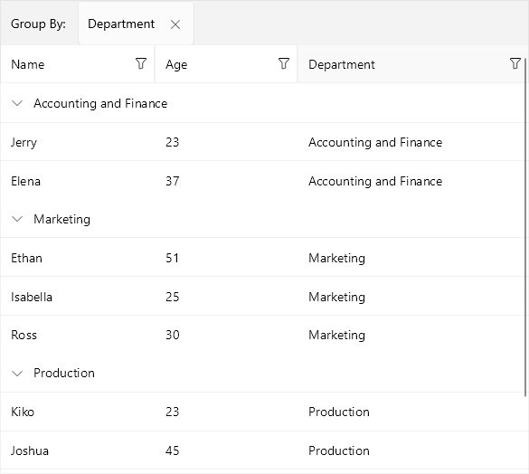

# Property Group Descriptor for .NET MAUI DataGrid

The `PropertyGroupDescriptor` is used to group the data in a [.NET MAUI DataGrid]() by property from the class that defines your objects.

To use the `PropertyGroupDescriptor`, you have to set its `PropertyName` (`string`) property, which gets or sets the name of the property that is used to retrieve the key by which to group.

>note You can sort the groups in ascending or descending order by using the `SortOrder` property.

Let's, for example, have the following business object:

<snippet id='datagrid-grouping-object' />

Add a sample `ViewModel` class with a collection of `Person` objects:

<snippet id='datagrid-grouping-viewmodel' />

Define the `DataGrid`:

<snippet id='datagrid-grouping-propertygroupdescriptor-xaml' />

All that is left is to set is the `ViewModel` as `BindingContext` of the page:

<snippet id='datagrid-grouping-propertygroupdescriptor-setvm' />

Apply the `PropertyGroupDescriptor`:

<snippet id='datagrid-grouping-propertygroupdescriptor' />

Here is how the DataGrid looks when it's grouped:

## See Also

- [Grouping UI]()
- [Group Header Template]()