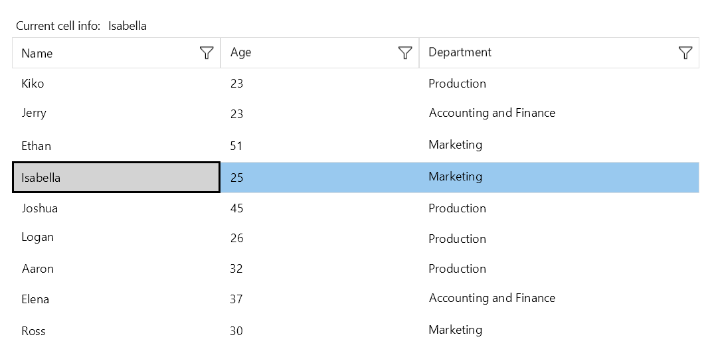

# Keyboard

RadDataGrid exposes several useful properties and events, which can help you control the keyboard interaction and get notified when keyboard events occur.

>important Keyboard navigation support is available only on Windows.

In the following table you can find some of the actions and the respective hotkeys that invoke them:

| Hotkey 		    | Action 			|
|-------------------|-------------------|
| `Arrow Keys`      | Changes the current cell. The selection is changed as well when in single mode.|
| `F2`              | Enter in edit mode of the current cell.|
| `Enter `	        | Select next/previous row. When in edit mode the changes are committed and the next row is selected.|
| `Esc `		    | Cancel the editing of the cell if such is present.|
| `PageUp `		    | When `Ctrl` is pressed it changes the current cell to be first cell. Without `Ctrl` the control will scroll down based on the number of items in the viewport.|
| `PageDown `	    | When `Ctrl` is pressed it changes the current cell to be last cell. Without `Ctrl` the control will scroll up based on the number of items in the viewport.|
| `Home `	        | Focus first cell of selected cell. When `Ctrl` is pressed - focus the first cell of the grid.|
| `End  `	        | Focus last cell of selected cell. When `Ctrl` is pressed - focus the last cell of the grid.|
| `Tab  `	        | Focus next cell or previous cell when shift is pressed. We tries to focus the next/previous editor when in edit mode. |

* `CurrentCell`(of type `DataGridCellInfo`)&mdash; Specifies the information for the current cell received during a keyboard navigation. 

## Events

DataGrid exposes the `CurrentCellChanged` event which is invoked when the current cell changes during a keyboard navigation. The `CurrentCellChanged` event handler receives two parameters:
	* The sender argument, which is of type object, but can be cast to the `RadDataGrid` type.
	* A `CurrentCellChangedEventArgs` object, which provides the following properties:
		- `OldCurrentCell`&mdash;Gets the previously `CurrentCell`.
		- `NewCurrentCell`&mdash;Gets the new `CurrentCell` received from the keyboard navigation.

## Styling

Easily apply a style to the current cell using the `CurrentCellStyle`(of type `DataGridBorderStyle`). Apply `BackgroundColor`, `BorderColor` and `BorderThickness`.

## Example

Here is an example with the `CurrentCell`, `CurrentCellChanged` and `CurrentCellStyle`.

**1** The used ViewModel and Business object:

ViewModel:

<snippet id='datagrid-grouping-propertygroupdescriptor-viewmodel' />

Business object:

<snippet id='datagrid-grouping-propertygroupdescriptor-object' />

**2** DataGrid definition in XAML

<snippet id='datagrid-keyboard-navigation-xaml' />

**3** The style used for the `CurrentCellStyle` and defined in the page's resources: 

<snippet id='datagrid-keyboard-navigation-style' />

**4** The `CurrentCellChanged` event:

<snippet id='datagrid-currentcell-changed' />

This is the final result:

## See Also

- [Getting Started]()
- [Selection]()
- [Sorting]()
- [Filtering]()
- [Grouping]()
- [Editing]()
