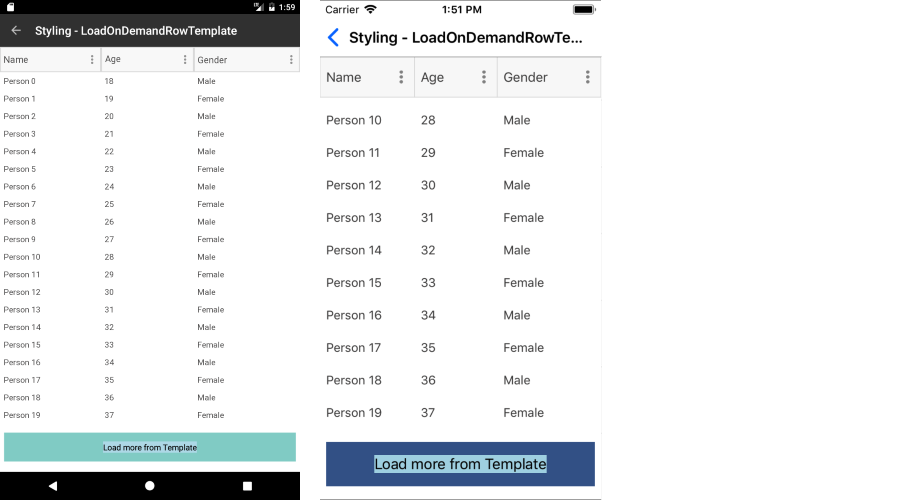

# Load On Demand #

In specific cases you may need to load data in the **RadDataGrid** when the control is already displayed as this can improve the performance and save computing resources. Loading a large data set on a mobile device has its challenges. One of the most popular approaches is using incremental data loading in the moment the items need to be visualized. 

## Modes

**RadDataGrid** offers two loading modes which are present in the **LoadOnDemandMode** enumeration:

* **Automatic**: The load-on-demand mechanism is activated when you scroll down near the last item present in the view port. 
 
>important You can control when the items will start loading more precisely by setting the **LoadOnDemandBufferItemsCount** property. It indicates at what point the additional items will start loading. For example, setting it to 20 will cause the new items to be loaded when you have scrolled the RadDataGrid so that only 20 of the originally loaded items are left below.

* **Manual**: A "Load More" button is present at the bottom of the RadDataGrid. Clicking it will load additional items based on the approach you have chosen for loading the items(through the event, the command or the collection).

## Approaches 

There are three different options for using the load-on-demand feature. You can choose the most convenient for you based on your application requirements:

 * [Using the LoadOnDemand Collection](#loadondemandcollection)
 * [Using the LoadOnDemand event](#loadondemand-event)
 * [Using the LoadMoreData Command](#loadmoredata-command)

### LoadOnDemandCollection

In order to use this approach, you should feed the **RadDataGrid** with a collection of type **LoadOnDemandCollection**. It is a generic type, so you need to point the type of objects it will contain. It extends the ObservableCollection<T> class and expects a Func<CancellationToken, IEnumerable> in the constructor. Here is a simple setup that shows how to use the collection:

<snippet id='datagrid-loadondemand-collection-csharp'/>
```C#
this.Items = new LoadOnDemandCollection<Person>((cancelationToken) =>
{
    var list = new List<Person>();
    for (int i = 0; i < 10; i++)
    {
        var person = new Person { Name = "LOD Person " + i, Age = i + 18, Gender = i % 2 == 0 ? Gender.Male : Gender.Female };
        list.Add(person);
    }

    return list;
});
```

where the **Items** property is declared as follows:

<snippet id='datagrid-loadondemand-collection-property-csharp'/>
```C#
public LoadOnDemandCollection<Person> Items { get; set; }
```

### LoadOnDemand Event

You can load new items by utilizing the **LoadOnDemand** event. It uses LoadOnDemandEventArgs arguments through which you need to indicate when the data is loaded so that the event is correctly fired afterwards. Here is an example:

<snippet id='datagrid-loadondemand-event-csharp'/>
```C#
private void dataGrid_LoadOnDemand(object sender, Telerik.XamarinForms.DataGrid.LoadOnDemandEventArgs e)
{
    for (int i = 0; i < 15; i++)
    {
        ((sender as RadDataGrid).ItemsSource as ObservableCollection<Person>).Add(new Person() { Name = "Person " + i, Age = i + 18, Gender = i % 2 == 0 ? Gender.Male : Gender.Female });
    }
    e.IsDataLoaded = true;
}
```

### LoadMoreData Command

The **LoadMoreData** command is another alternative which you can use which is suitable for MVVM scenarios. Here is how you can create such a command:

<snippet id='datagrid-customloadmoredatacommand-csharp'/>
```C#
public class CustomLoadMoreDataCommand : DataGridCommand
{
    public CustomLoadMoreDataCommand()
    {
        this.Id = DataGridCommandId.LoadMoreData;
    }

    public override bool CanExecute(object parameter)
    {
        return true;
    }

    public async override void Execute(object parameter)
    {
        if (parameter == null)
        {
            return;
        }

        ((LoadOnDemandContext)parameter).ShowLoadOnDemandLoadingIndicator();

        await System.Threading.Tasks.Task.Delay(1500);
        var viewModel = this.Owner.BindingContext as LoadMoreDataCommandViewModel;
        if (viewModel != null)
        {
            for (int i = 0; i < 10; i++)
            {
                viewModel.Items.Add(new Person { Name = "Person " + i, Age = i + 18, Gender = i % 2 == 0 ? Gender.Male : Gender.Female });
            }
        }
        ((LoadOnDemandContext)parameter).HideLoadOnDemandLoadingIndicator();
    }
}
```

Eventually, you need to add this custom command to the **Commands** collection of the **RadDataGrid**.

<snippet id='datagrid-customloadmoredatacommand-addtocollection-csharp'/>
```C#
this.dataGrid.Commands.Add(new CustomLoadMoreDataCommand());
```

>important Invoking the **ShowLoadOnDemandLoadingIndicator** and **HideLoadOnDemandLoadingIndicators** is a notable part as without calling these methods the BusyIndicator used for the functionality will not be visualized.

## Styling

Besides the different approaches for loading the data, **RadDataGrid** exposes several mechanisms related to the styling of the functionality which you can use according to the approach you have chosen.

### LoadOnDemandRowStyle 
This property can be used to style the appearance of the row that contains the "Load More" button when the **LoadOnDemandMode** is **Manual**.

The custom style is of type DataGridLoadOnDemandRowStyle:

<snippet id='datagrid-loadondemandrowstyle-xaml'/>
```XAML
<telerikDataGrid:DataGridLoadOnDemandRowStyle x:Key="CustomDataGridLoadOnDemandRowStyle" 
                                              BackgroundColor="LightYellow"
                                              BorderColor="LightBlue"
                                              IndicatorAnimationColor="Orange"
                                              IndicatorAnimationType="Animation5"
                                              HorizontalTextAlignment="Center"
                                              VerticalTextAlignment="Center"
                                              OverlayOpacity="0.5"
                                              Text="Some Text"
                                              TextFontSize="16"
                                              TextColor="DarkGray"
                                              TextFontFamily="Times New Roman"/>
```

And you should set it to the LoadOnDemandRowStyle property of the RadDataGrid:

<snippet id='datagrid-setting-loadondemandrowstyle-xaml'/>
```XAML
<telerikDataGrid:RadDataGrid x:Name="dataGrid" 
							 ItemsSource="{Binding Items}"
                             LoadOnDemand="dataGrid_LoadOnDemand"
                             LoadOnDemandMode="Manual"
                             LoadOnDemandRowStyle="{StaticResource CustomDataGridLoadOnDemandRowStyle}"/>
```

#### Figure 2: The appearance of the row after setting the LoadOnDemandRowStyle


### LoadOnDemandRowTemplate 

This property can be used to set the template of the row that contains the "Load More" button when the **LoadOnDemandMode** is **Manual**.

Here is a custom DataTemplate:

<snippet id='datagrid-loadondemandrowtemplate-xaml'/>
```XAML
<DataTemplate x:Key="CustomLoadOnDemandRowTemplate">
    <Label Text="Load more from Template"
           Margin="0,30,0,30"
           HorizontalOptions="CenterAndExpand"
           VerticalOptions="CenterAndExpand"
           IsEnabled="{Binding IsDataLoading}">
        <Label.Triggers>
            <Trigger TargetType="Label"
                     Property="IsEnabled" Value="False">
                <Setter Property="BackgroundColor" Value="LightBlue" />
            </Trigger>
        </Label.Triggers>
    </Label>
</DataTemplate>
```

And how you set the property:

<snippet id='datagrid-setting-loadondemandrowtemplate-xaml'/>
```XAML
<telerikDataGrid:RadDataGrid x:Name="dataGrid"
							 ItemsSource="{Binding Items}"
                             LoadOnDemand="dataGrid_LoadOnDemand"
                             LoadOnDemandMode="Manual"
                             LoadOnDemandRowTemplate="{StaticResource CustomLoadOnDemandRowTemplate}"/>
```


#### Figure 3: The appearance of the row after setting the LoadOnDemandRowTemplate



## See Also

* [DataGrid Grouping]()
* [DataGrid Sorting]()
