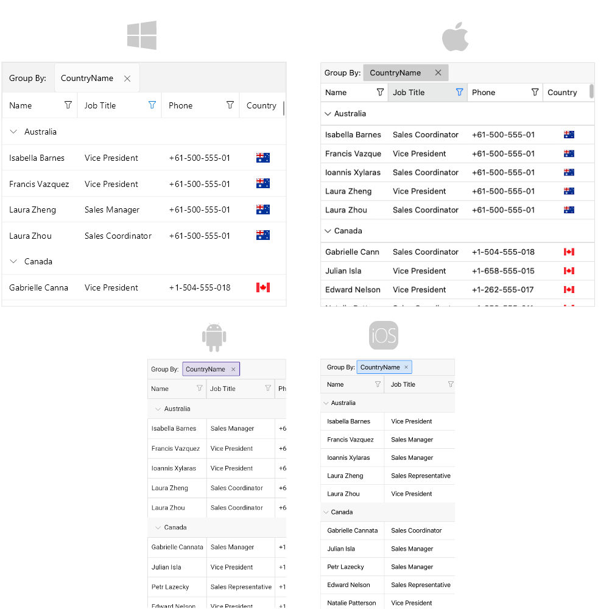

# .NET MAUI DataGrid Overview

The Telerik UI for .NET MAUI DataGrid is a powerful control that allows you to visualize and edit tabular represented data in your .NET MAUI applications.

Most of the data on the Internet is stored in tables within a database. The Telerik UI for .NET MAUI DataGrid provides the same abstraction over the data&mdash;It has columns and rows, and the intersection of a row and a column is called a cell.

When the data from a database is sent to the client, usually converted to a Business object (or the so-called `ViewModel`) where each instance represents a table row and each property of the object represents a column within the original table. The DataGrid also supports alternating row colors so that your users can distinguish one row from another.

The optimized data layer of the DataGrid enables fast grouping, sorting, and filtering operations. The user interface uses virtualization for its row and cell elements, which means that visual elements are created only when needed and only for the currently visible cells.

## Key Features of the Telerik .NET MAUI Grid

* [Different column types]()&mdash;The MAUI DataGrid provides a set of built-in columns such as Text, Boolean, Numeric, ComboBox, Date, Time, and Template. These predefined templates allow you to handle different data types and user scenarios, each with its specific editor.

* [Load on demand]()&mdash;In some cases, you may need to load data in the .NET MAUI DataGrid when the control is already displayed as this can improve the performance of your application. The DataGrid offers automatic data loading once the user scrolls to the last available record, or by displaying a customizable button which will initiate the loading of more data items.

* [Editing]()&mdash;You can enable users to edit the data presented in the .NET MAUI DataGrid. Depending on the column data type, a relevant editor allows end users to edit content in a friendly environment. For example, if one of the columns is a date, a date-picker will be used to offer a change in the date field.

* [Sorting](), [filtering](), and [grouping]()&mdash;Perform SORT, FILTER, and GROUP operations on your data by using the convenient API of the control.

* [Selection modes]()&mdash;The DataGrid features a single or a multiple-item selection and provides options for controlling the cell or row selection unit, thus enabling any selection scenario you want your MAUI application users to have.

* [Column settings]()&mdash;The .NET MAUI DataGrid provides a number of features and configuration options related to its columns to provide a flexible and usable user experience. For example, you can enable [column reordering]() and [resizing](), allow users to [lock columns]() and keep the important information always on top, and [add a column footer]() to the component.

* [Search as you type]()&mdash;The DataGrid provides the ability to search for specific data within its `ItemsSource` by using its built-in search functionality.

* [Row height]()&mdash;Manually set the grid row height apply row height to control over the way the content is accommodated inside the grid cells.

* [Row details]()&mdash;Represent additional information for the data in the row.

* [Aggregates support]()&mdash;You can use the exposed API for applying aggregates functions.

* [Keyboard navigation]() support&mdash;Use keyboard keys for navigation in the MAUI DataGrid control. This feature is available on WinUI and MacCatalyst.

* [Empty template]()&mdash;When the control does not have any data (`ItemsSource` is null or the collection is empty), an empty template is displayed in the DataGrid.

* [Commands]()&mdash;The DataGrid allows you to attach commands, such as `ColumnHeaderTap`, `CellTap`, `BeginEdit`, and more, which will be executed when certain actions occur.

* [Flexible styling API]()&mdash;The .NET MAUI DataGrid is customizable if you prefer to use your own styling.

* [Localization support]()&mdash;Translate the text displayed in the Filtering UI, Grouping panel, etc. to other languages, so that your application can be adapted to different cultures.

## Next Steps

- [Getting Started with Telerik UI for .NET MAUI DataGrid]()

## See Also

- [.NET MAUI DataGrid Product Page](https://www.telerik.com/maui-ui/datagrid)
- [.NET MAUI DataGrid Forum Page](https://www.telerik.com/forums/maui?tagId=1801)
- [Telerik .NET MAUI Blogs](https://www.telerik.com/blogs/mobile-net-maui)
- [Telerik .NET MAUI Roadmap](https://www.telerik.com/support/whats-new/maui-ui/roadmap)
